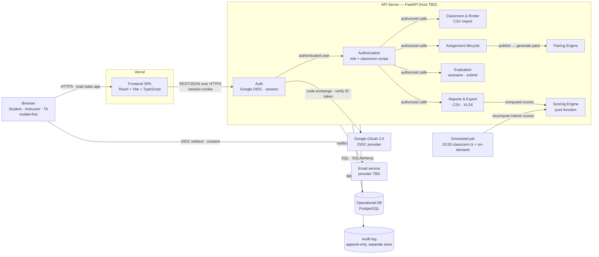

# Pairwise — Architecture

> **Status:** draft (WS-02). Only the frontend landing page exists today; every
> other box below is planned. Requirements come from [prd.md](prd.md) (PRD v2.0,
> reference architecture in §6); stack decisions from
> [tech-stack.md](../memory-bank/standards/tech-stack.md); database schema in
> [erd.md](erd.md).
>
> Mermaid rather than an exported image, so the diagram shows up in `git diff`
> and an AI agent can read it as text.

## Component diagram

## What talks to what

| Edge | Protocol | Carries |
|---|---|---|
| Browser → Frontend | HTTPS | Static HTML/JS/CSS built by Vite, served by Vercel |
| Browser → Google | OIDC authorization code, browser redirect | Consent screen and account chooser; Google sends the browser back to the API callback with `code` + `state` (FR-AUTH-01) |
| Frontend → API | REST/JSON over HTTPS, same site as the SPA | Every request, with the session cookie; standard error shape from PRD §12 |
| Auth → Google | HTTPS, server to server | Exchange `code` for tokens; verify the ID token with Google's public keys (JWKS); then the `hd` domain check (FR-AUTH-02) |
| Auth → Authorization | in-process | User id, then role + classroom scope checked on every call (FR-AUTHZ-01/02) |
| Assignment → Pairing | in-process | Generate all `pair_assignment` rows at publish, never at runtime (FR-PAIR-01) |
| Job → Scoring | scheduled trigger | Interim recompute at 02:00 classroom time and on demand (FR-SCORE-06) |
| API → Database | SQL via SQLAlchemy | All operational state; schema in [erd.md](erd.md) |
| API → Audit log | append-only insert | Publish, regenerate, override, finalize, identity access (FR-AUDIT-01..03) |
| API → Email | provider API | Events in FR-NOTIF-01..05; no scores in the body (FR-NOTIF-06) |

## Architecture rules from the PRD

- **AR-01** — Scoring Engine is a pure function of database state, so recompute is reproducible (FR-SCORE-10).
- **AR-02** — Every read that can reveal an evaluator's identity goes through the one authorization layer.
- **AR-03** — The audit log is append-only and stored separately from operational data.

## Auth and session flow

Google OAuth is fixed by FR-AUTH-01. The team chose the OAuth 2.0 authorization
code flow run by the server, with browser redirects, and server-side sessions in
an `httpOnly` cookie (FR-SEC-01) over bearer tokens. No Google token or session
token is ever readable by JavaScript.

1. "Sign in with Google" links to `GET /api/auth/google/start`. The API stores a
   random `state` and `nonce` in a short-lived cookie and redirects to Google
   with `prompt=select_account`, so the account chooser always appears.
2. The user signs in or cancels. Google redirects the browser to
   `GET /api/auth/google/callback` with `code` + `state`, or with `error`.
3. The API checks `state` against the cookie, exchanges `code` with Google,
   verifies the ID token (signature, audience, `nonce`), checks the allowed
   domain, matches the normalized email against rosters (FR-AUTH-03), stores a
   new row in the `session` table, sets a 12-hour session cookie (FR-AUTH-04),
   and redirects to the SPA.
4. On any failure (cancel, Google error, bad `state`, domain, account conflict)
   no session is created. The API redirects to `/login?error=<CODE>`, and the
   login page shows the message without redirecting to Google on its own
   (US-AUTH-02).
5. Every later request carries the session cookie; the API looks up the session
   and derives role and classroom scope from it. Logout revokes the row.

## Current state vs planned

| Component | State |
|---|---|
| Frontend SPA on Vercel | ✅ Landing page live at `https://sdpx-very-good.vercel.app` |
| API server, all modules | ⏳ Not started |
| Database, audit log | ⏳ Not started; PostgreSQL chosen, schema drafted in [erd.md](erd.md) |
| Google OAuth, sessions | ⏳ Not started; server-side authorization code flow + cookie session chosen |
| Scheduled job, email | ⏳ Not started; runner and provider not decided |

## Candidate units

Loosely coupled pieces that can each get a `memory-bank/units/<name>/unit-brief.md`:

| Unit | Why it is its own unit | Test style from PRD §18 | Bolt type |
|---|---|---|---|
| `pairing-engine` | Pure algorithm: roster + config in, pair assignments out (§8) | Property-based, INV-1..5 | DDD |
| `scoring-engine` | Pure math: comparisons + config in, scores out (§9) | Unit + golden test from §9.5 | DDD |
| `classroom-roster` | Atomic CSV import, email normalization, membership (FR-CLASS-*) | Unit + integration | Simple |
| `evaluation` | Autosave, submit, re-submit, deadline enforcement (FR-EVAL-*) | E2E | Simple |

## Where we differ from PRD §6

| PRD §6 says | Our plan | Status |
|---|---|---|
| Web App with SSR | Vite SPA | SSR is not a MUST requirement; keep the SPA and record why (ADR) |
| PostgreSQL | PostgreSQL | ✅ Decided 2026-09-14 (switched from SQLite); record as an ADR |
| Audit log in separate storage | Not planned | Separate database, or a separate schema with insert-only permissions |
| Email notification service | Not planned | Pick a provider; FR-NOTIF-* are Must |
| Deploy on university infra or approved cloud (C1) | Vercel + backend host TBD | Ask the instructor whether Vercel is approved |

## Open architecture decisions

- **Same-site API routing.** Cookie sessions only work when the browser treats
  the API as the same site as the SPA; cookies sent across sites are blocked.
  The plan is a Vercel rewrite from `/api/*` to the backend, which must be
  confirmed once the backend host is chosen. In `openapi.yaml` the security
  scheme is therefore a cookie (`type: apiKey`, `in: cookie`), not a bearer token.
  The Google OAuth client must list
  `https://sdpx-very-good.vercel.app/api/auth/google/callback` as a redirect URI,
  which also only works once `/api/*` is routed to the backend.
- **Backend and database host.** Vercel serves the frontend; where FastAPI and
  PostgreSQL run is not decided.
- **Scheduled job runner.** Needs a scheduler on the backend host.

Requirement-level gaps are tracked in [open-questions.md](open-questions.md).
