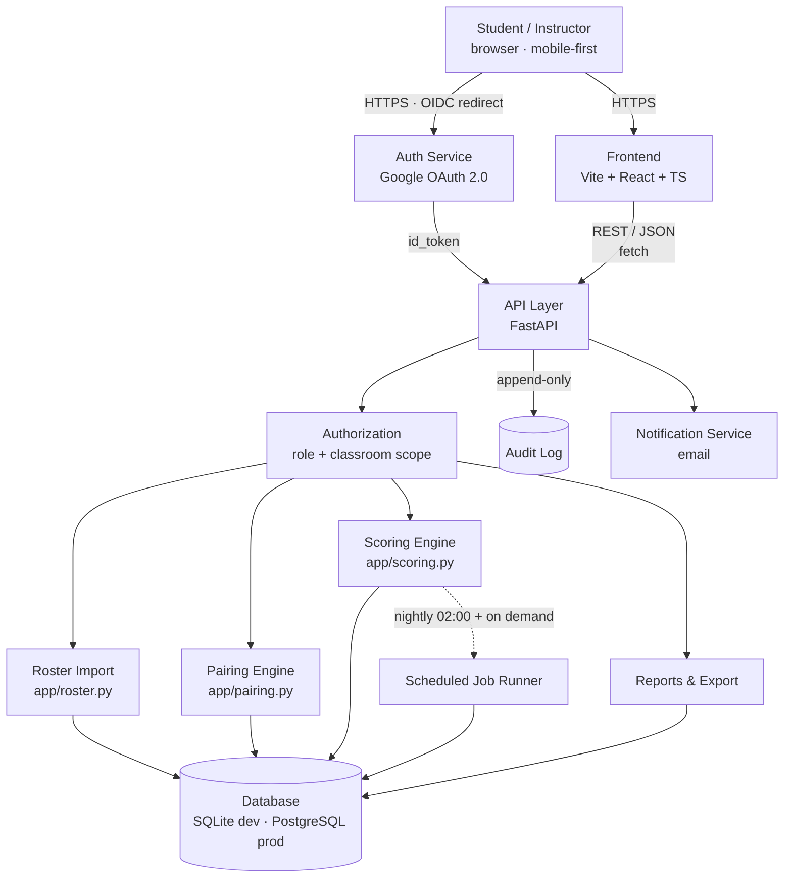
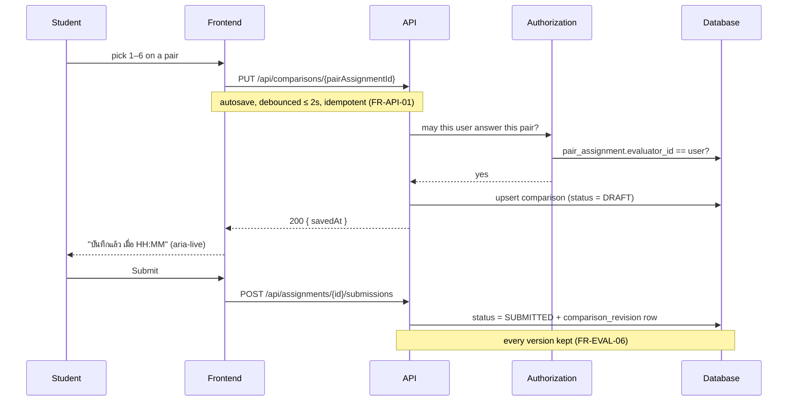
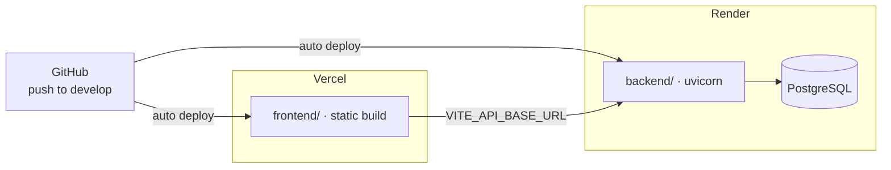

# PairEval — Architecture

> Mermaid rather than exported images, so the diagram shows up in `git diff`
> and an AI agent can read it as text. Source of truth for requirements:
> `pairwise_evaluation_prd.md`.

## Component diagram

## What talks to what

| Edge | Protocol | Carries |
|---|---|---|
| Browser → Auth | HTTPS, OIDC redirect | Google consent, `id_token` |
| Browser → Frontend | HTTPS | HTML/JS/CSS |
| Frontend → API | REST/JSON over HTTPS | classrooms, assignments, comparisons |
| API → Authorization | in-process | every request, no exceptions (AR-02) |
| Engines → Database | SQLAlchemy | rows only — the engines hold no state |
| API → Audit log | append-only writes | actor, action, before/after, reason |
| Scheduler → Scoring | in-process | nightly recompute (FR-SCORE-06) |

## Where the rules actually live

The two engines are the parts that must be provably right, so they are pure
functions over dataclasses with no database access at all (AR-01). That is what
lets `backend/tests/property/` throw thousands of random classrooms at the
pairing rules in under two seconds.

| Module | Owns | Spec |
|---|---|---|
| `app/pairing.py` | feasibility, allocation, INV-1 … INV-5 | §8 |
| `app/scoring.py` | 6-point scale, quality index, band mapping, participation | §9 |
| `app/roster.py` | CSV parsing, email normalisation, formula-injection defence | §7.2 |
| `app/services.py` | wiring the engines to storage; publish and score flows | §7.3–7.6 |
| `app/utils.py` | ORM ↔ engine translation only | — |

## Three architectural rules

- **AR-01** — the Scoring Engine is a pure function of what is in the database.
  Recompute must give identical digits, or a mark cannot be defended in an
  appeal (FR-SCORE-10).
- **AR-02** — every read that could reveal *who evaluated whom* goes through
  one authorization layer. Two code paths means one of them will be forgotten.
- **AR-03** — the audit log is append-only and stored separately from
  operational data. A log the application can edit is not evidence.

## Request path for a submitted comparison

## Deployment topology

Neither side is connected yet — see the Deploy Loop section in
`memory-bank/standards/tech-stack.md` for exactly what is left to do.
