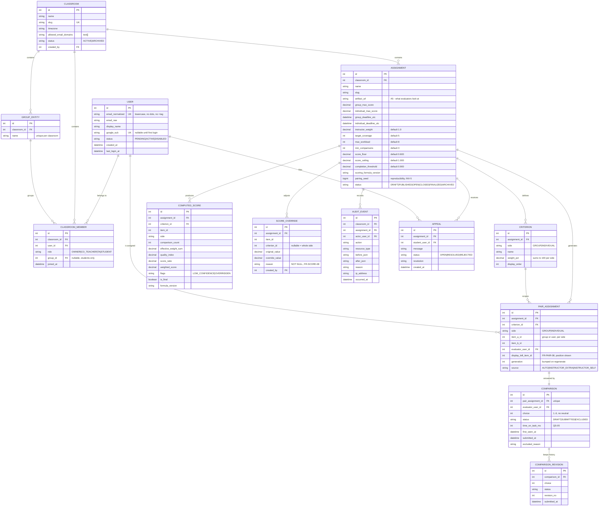

# PairEval — Entity Relationship Diagram

> Follows PRD §11. The tables in `backend/app/models.py` are a prototype subset;
> the gaps are listed at the bottom and tracked in `docs/backlog.md`.

## Diagram

## Cardinalities worth arguing about

| Relationship | Cardinality | Why |
|---|---|---|
| `PAIR_ASSIGNMENT` → `COMPARISON` | 1 : 1 | One evaluator, one pair, one current answer. History lives in `COMPARISON_REVISION`, so re-submitting (FR-EVAL-06) does not multiply rows in the scored table. |
| `USER` ↔ `CLASSROOM` | N : M via `CLASSROOM_MEMBER` | The same person is a lecturer in one classroom and a student in another (FR-AUTHZ-03). |
| `GROUP_ENTITY` → `CLASSROOM_MEMBER` | 1 : N | Membership carries the group, not the user row, so a student can be regrouped without touching their identity. |
| `ASSIGNMENT` → `COMPUTED_SCORE` | 1 : N | One row per (criterion, item, is_final) so the interim and finalised numbers coexist for audit. |

## Data rules

| ID | Rule |
|---|---|
| DR-01 | Only `comparison.status = SUBMITTED` enters a calculation. |
| DR-02 | A `pair_assignment` with submitted comparisons is never deleted — regeneration bumps `generation` instead. |
| DR-03 | `computed_score` with `is_final = true` is immutable; changes go through `score_override`. |
| DR-04 | Scores are `numeric`, never `float`. |
| DR-05 | Every timestamp is stored UTC and converted only for display. |

## Gap between this diagram and `backend/app/models.py`

The prototype implements `Classroom`, `Group`, `Student`, `Assignment`,
`Criteria` and `Pair`. Still missing:

| Missing | Consequence today |
|---|---|
| `COMPARISON` and `COMPARISON_REVISION` | The scoring engine is fully tested but has nothing to read from in the API — scores cannot be computed end-to-end yet. |
| `AUDIT_EVENT` | FR-AUDIT-01 is unimplemented, and §19 marks it as one of the three items that must not be cut. |
| `email_normalized` on the student table | `app/roster.py` normalises correctly, but the column that would enforce uniqueness does not exist. |
| `numeric` score columns | `Assignment.group_score` is `Float`, which contradicts DR-04. |
| `CLASSROOM_MEMBER` roles | Roles are not modelled at all, so §3's permission matrix cannot be enforced. |

Each of these is an issue in `docs/backlog.md`.
