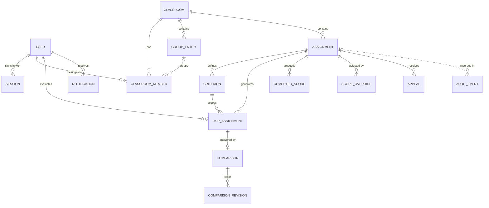
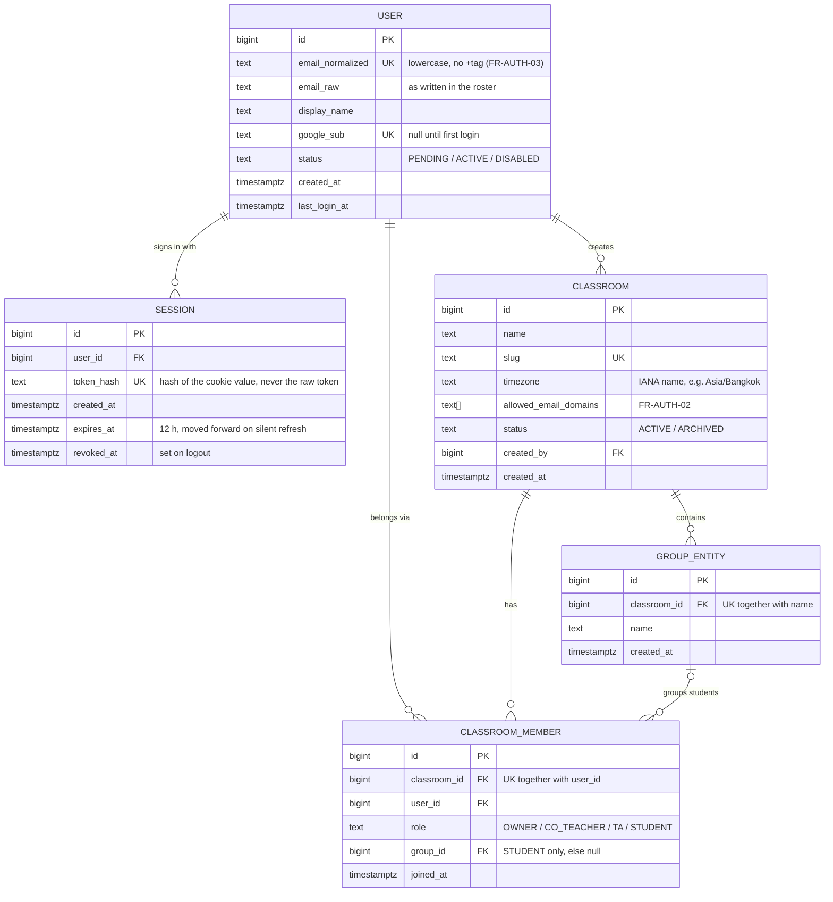
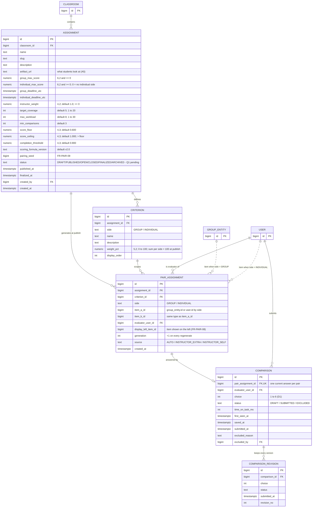

# Pairwise — ER Diagram

> **Status:** draft (WS-02) · ที่มา: [prd.md](prd.md) §11 Data Model (PRD v2.0)
>
> **การตัดสินใจที่ใช้ในไฟล์นี้**
>
> | เรื่อง | ตัดสินว่า |
> |---|---|
> | Database | **PostgreSQL** — ใช้ชนิดข้อมูลของ PostgreSQL (`text[]`, `numeric`, `timestamptz`, `jsonb`) |
> | Session | **Cookie + ตาราง `session`** (FR-SEC-01, FR-AUTH-04) — ตารางนี้ไม่มีใน PRD เพิ่มตามการตัดสินใจของทีม |
> | Item ใน pair / score | **ยึดตาม PRD** — `item_a_id`, `item_b_id`, `item_id` ตัวเดียว ชี้ไป group หรือ user ตาม `side` |
> | เวลาเปิด / ปิด assignment | ⚠️ **ยังไม่ตัดสิน** — ใช้ field ตาม PRD ไปก่อน รอคำตอบ [Q1](open-questions.md#q1--assignment-เปิดให้ประเมินเมื่อไหร่-และ-2-deadline-ปิดอย่างไร) |

## วิธีอ่าน

- `PK` = primary key · `FK` = foreign key · `UK` = unique
- **เส้นทึบ** = มี foreign key จริงใน database
- **เส้นประ** = อ้างอิงเชิงตรรกะ **ไม่มี** foreign key — database บังคับให้ไม่ได้ ต้องตรวจใน code
  (ใช้กับ item แบบ polymorphic และ audit log ที่อยู่คนละ storage)
- Cardinality: `||` = หนึ่งเท่านั้น · `|o` = ศูนย์หรือหนึ่ง · `o{` = ศูนย์หรือหลาย · `|{` = หนึ่งหรือหลาย

---

## 1. ภาพรวม

---

## 2. Identity & Classroom

---

## 3. Assignment & Evaluation

---

## 4. Scoring & Governance

```mermaid
erDiagram
    ASSIGNMENT ||--o{ COMPUTED_SCORE : "produces"
    CRITERION ||--o{ COMPUTED_SCORE : "scored on"
    ASSIGNMENT ||--o{ SCORE_OVERRIDE : "adjusted by"
    CRITERION |o--o{ SCORE_OVERRIDE : "optionally scopes"
    USER ||--o{ SCORE_OVERRIDE : "creates"
    ASSIGNMENT ||--o{ APPEAL : "receives"
    USER ||--o{ APPEAL : "files"
    USER ||--o{ NOTIFICATION : "receives"
    CLASSROOM ||..o{ AUDIT_EVENT : "recorded in"
    ASSIGNMENT |o..o{ AUDIT_EVENT : "recorded in"
    USER ||..o{ AUDIT_EVENT : "acts in"

    COMPUTED_SCORE {
        bigint id PK
        bigint assignment_id FK
        bigint criterion_id FK
        text side "GROUP / INDIVIDUAL"
        bigint item_id "group_entity.id or user.id by side"
        int comparison_count
        numeric effective_weight_sum "8,3"
        numeric quality_index "6,5; q in 0 to 1"
        numeric score_ratio "6,5"
        numeric weighted_score "8,3"
        text[] flags "LOW_CONFIDENCE, OVERRIDDEN, ..."
        boolean is_final "default false"
        text formula_version
        timestamptz computed_at
    }
    SCORE_OVERRIDE {
        bigint id PK
        bigint assignment_id FK
        text side
        bigint item_id "group_entity.id or user.id by side"
        bigint criterion_id FK "null = whole item"
        numeric original_value
        numeric override_value
        text reason "NOT NULL (FR-SCORE-08)"
        bigint created_by FK
        timestamptz created_at
    }
    APPEAL {
        bigint id PK
        bigint assignment_id FK
        bigint student_user_id FK
        text message
        text status "OPEN / RESOLVED / REJECTED"
        text resolution
        bigint resolved_by FK
        timestamptz created_at
        timestamptz resolved_at
    }
    NOTIFICATION {
        bigint id PK
        bigint user_id FK
        text type
        jsonb payload_json "no scores inside (FR-NOTIF-06)"
        timestamptz sent_at
        timestamptz read_at
    }
    AUDIT_EVENT {
        bigint id PK
        bigint classroom_id "logical ref; separate store (AR-03)"
        bigint assignment_id "logical ref; nullable"
        bigint actor_user_id "logical ref"
        text action
        text resource_type
        bigint resource_id
        jsonb before_json
        jsonb after_json
        text reason
        inet ip_address
        timestamptz occurred_at
    }
    ASSIGNMENT {
        bigint id PK
    }
    CRITERION {
        bigint id PK
    }
    USER {
        bigint id PK
    }
    CLASSROOM {
        bigint id PK
    }
```

---

## 5. Cardinality

| ความสัมพันธ์ | ชนิด | ความหมาย |
|---|---|---|
| USER ↔ CLASSROOM ผ่าน CLASSROOM_MEMBER | **N:M** | คนหนึ่งอยู่ได้หลาย classroom และแต่ละ classroom มีหลายคน — role ผูกกับ classroom ไม่ใช่ผูกกับ user (FR-AUTHZ-03) |
| CLASSROOM → GROUP_ENTITY | 1:N | กลุ่มเป็นของ classroom เดียว |
| GROUP_ENTITY → CLASSROOM_MEMBER | 0..1:N | นักศึกษาอยู่ได้ไม่เกิน 1 กลุ่ม · staff ไม่มีกลุ่ม |
| USER → SESSION | 1:N | login หลายเครื่องพร้อมกันได้ |
| CLASSROOM → ASSIGNMENT | 1:N | |
| ASSIGNMENT → CRITERION | 1:N | แต่ละเกณฑ์อยู่ฝั่ง GROUP หรือ INDIVIDUAL ฝั่งเดียว |
| ASSIGNMENT → PAIR_ASSIGNMENT | 1:N | สร้างทั้งหมดตอน publish (FR-PAIR-01) |
| USER → PAIR_ASSIGNMENT (evaluator) | 1:N | |
| PAIR_ASSIGNMENT → COMPARISON | **1:0..1** | หนึ่งงานประเมินมีคำตอบปัจจุบันได้ไม่เกิน 1 — ยังไม่ตอบ = ไม่มีแถว |
| COMPARISON → COMPARISON_REVISION | 1:N | เก็บทุกครั้งที่ submit (FR-EVAL-06) |
| ASSIGNMENT → COMPUTED_SCORE | 1:N | ต่อ (item, criterion) ทั้ง interim และ final |
| ASSIGNMENT → SCORE_OVERRIDE / APPEAL | 1:N | |
| USER → NOTIFICATION | 1:N | |

---

## 6. Constraints และกฎของข้อมูล

| ตาราง | Constraint | ที่มา |
|---|---|---|
| `user` | `UNIQUE (email_normalized)`, `UNIQUE (google_sub)` | §11.1 |
| `session` | `UNIQUE (token_hash)` | เพิ่มตามการตัดสินใจเรื่อง session |
| `classroom_member` | `UNIQUE (classroom_id, user_id)` | §11.1 |
| `group_entity` | `UNIQUE (classroom_id, name)` | §11.1 |
| `assignment` | `CHECK (score_floor < score_ceiling)` · `CHECK` ค่า default และช่วงตามแผนภาพข้อ 3 | §11.1 |
| `pair_assignment` | `UNIQUE (assignment_id, criterion_id, evaluator_user_id, item_a_id, item_b_id, generation)` · `CHECK (item_a_id <> item_b_id)` | §11.1 |
| `pair_assignment` | `CHECK (item_a_id < item_b_id)` — เพิ่มจาก PRD (แนะนำ) | ดูข้อ 7 |
| `comparison` | `UNIQUE (pair_assignment_id)` · `CHECK (choice BETWEEN 1 AND 6)` | §11.1 |
| `computed_score` | `UNIQUE (assignment_id, criterion_id, item_id, is_final)` | §11.1 |

| ID | กฎ |
|---|---|
| DR-01 | เฉพาะ `comparison.status = SUBMITTED` เท่านั้นที่เข้าสู่การคำนวณ |
| DR-02 | ห้ามลบ `pair_assignment` ที่มี comparison `SUBMITTED` — ใช้ `generation` ใหม่แทน |
| DR-03 | `computed_score` ที่ `is_final = true` แก้ไม่ได้ — แก้ผ่าน `score_override` เท่านั้น |
| DR-04 | คะแนนเก็บเป็น `numeric` ไม่ใช่ `float` |
| DR-05 | ทุก timestamp เก็บเป็น UTC (`timestamptz`) แปลงตอนแสดงผลเท่านั้น |

---

## 7. Item แบบ polymorphic

ตามที่ PRD กำหนด `pair_assignment.item_a_id`, `item_b_id`, `computed_score.item_id` และ `score_override.item_id`
ชี้ไป **`group_entity.id` เมื่อ `side = GROUP`** และ **`user.id` เมื่อ `side = INDIVIDUAL`**

- **Database บังคับ FK ไม่ได้** — code ต้องตรวจเองก่อน insert ว่า id นั้นมีอยู่จริง อยู่ใน classroom เดียวกัน และเป็นชนิดตรงกับ `side`
- **ไม่ชนกันแม้ group กับ user มี id เลขเดียวกัน** — เพราะทุกตารางที่มี item มี `criterion_id` และ criterion หนึ่งอยู่ฝั่งเดียวเสมอ
  ใน criterion เดียวกันจึงมีแต่ item ชนิดเดียว
- **ลบ group หรือ user แล้ว pair จะชี้ไปที่ว่าง** — ห้าม hard-delete ใช้ `status` แทน (สอดคล้องกับ FR-PRIV-02 ที่ให้ anonymize แทนการลบ)
- **เรียงลำดับ item ในคู่** — Glossary นิยาม pair เป็น `{a, b}` ที่ไม่เรียงลำดับ ถ้าไม่บังคับ `item_a_id < item_b_id`
  คู่ `(5, 9)` กับ `(9, 5)` จะผ่าน UNIQUE ทั้งคู่ ทำให้ evaluator ได้คู่เดิมซ้ำ (ผิด INV-2)
  ตำแหน่งที่แสดงจริงเก็บแยกอยู่แล้วใน `display_left_item_id`

---

## 8. ต่างจาก PRD §11

| เรื่อง | PRD | ERD นี้ | เหตุผล |
|---|---|---|---|
| ตาราง `session` | ไม่มี | เพิ่ม | ทีมเลือก cookie + server-side session |
| PAIR_ASSIGNMENT → COMPARISON | diagram เขียน `\|\|--o{` (1:N) | `\|\|--o\|` (1:0..1) | ตารางใน §11.1 มี `pair_assignment_id (UNIQUE)` — diagram ของ PRD ขัดกับตารางของตัวเอง |
| `CHECK (item_a_id < item_b_id)` | ไม่มี | แนะนำให้เพิ่ม | กัน INV-2 ดูข้อ 7 |
| ชนิดของ id | ไม่ระบุ | `bigint` | ผมเลือกเอง — เปลี่ยนเป็น `uuid` ได้ถ้าทีมต้องการ |
| `before_json`, `payload_json`, `ip_address` | ไม่ระบุชนิด | `jsonb`, `inet` | ชนิดของ PostgreSQL ที่ตรงกับข้อมูล |
| Audit log | อยู่ใน diagram เดียวกัน | เส้นประ ไม่มี FK | AR-03 ให้แยก storage จึงอ้าง FK ข้าม storage ไม่ได้ |

---

## 9. ตารางไหนใช้ใน milestone ไหน (PRD §19)

| Milestone | ตาราง |
|---|---|
| **M1 — Walking Skeleton** | `user`, `session`, `classroom`, `classroom_member`, `group_entity`, `assignment`, `criterion`, `pair_assignment`, `comparison`, `computed_score` |
| M2 — Core Complete | `comparison_revision` (re-submit) |
| M3 — Trustworthy | `score_override`, `appeal`, `audit_event` — PRD §19 ห้ามตัด FR-AUDIT-01 |
| M4 — Production Ready | `notification` |

---

## 10. รอคำตอบ

| คำถาม | กระทบ ERD อย่างไร |
|---|---|
| [Q1](open-questions.md#q1--assignment-เปิดให้ประเมินเมื่อไหร่-และ-2-deadline-ปิดอย่างไร) เปิด/ปิด assignment | อาจเพิ่ม `opens_at_utc` และแยก `status` เป็น `group_status` / `individual_status` ใน `assignment` |
| [Q3](open-questions.md#q3--comparison-ของอาจารย์นับเข้าเกณฑ์ขั้นต่ำหรือไม่) comparison ของอาจารย์นับเกณฑ์ไหม | ถ้านับเฉพาะนักศึกษา `computed_score` ต้องมี `student_comparison_count` แยก |
| Q4–Q6 (roster) | ไม่กระทบ schema — เป็นกฎตรวจตอน import |
