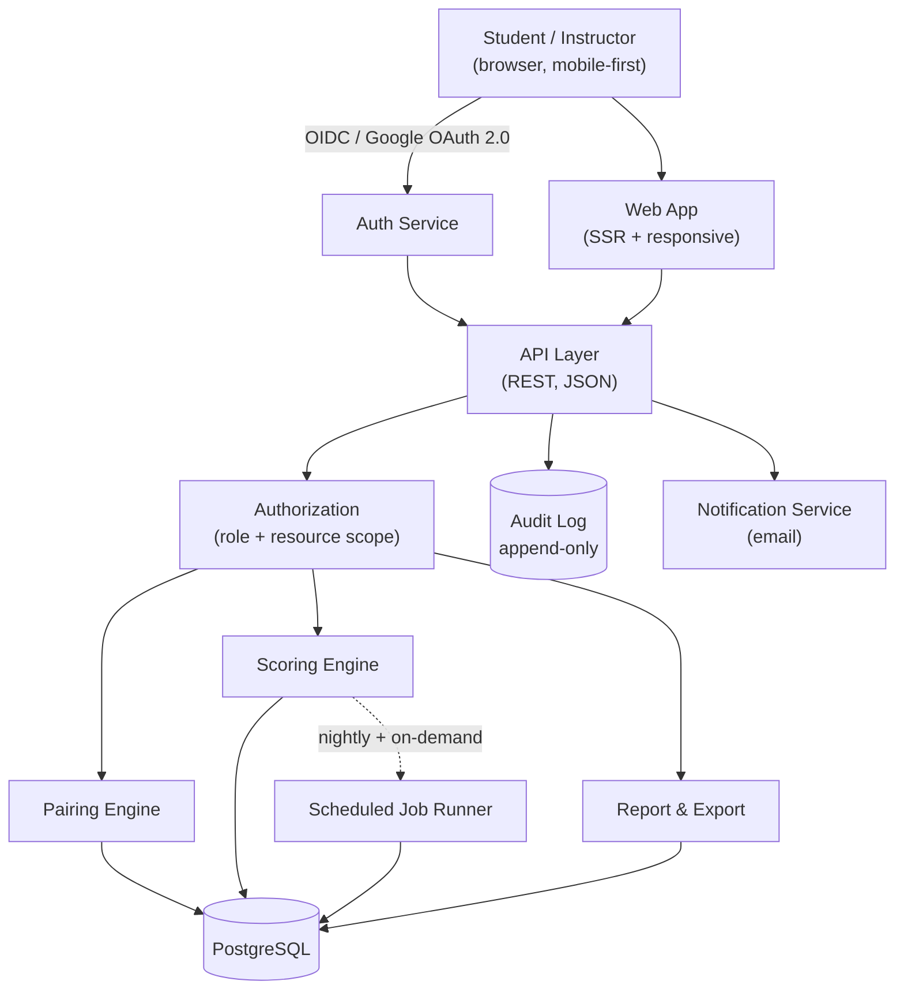
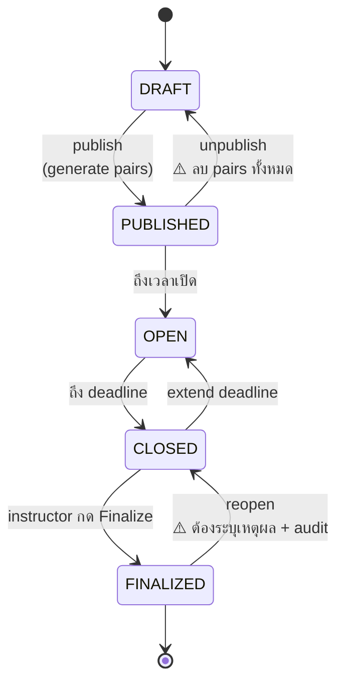
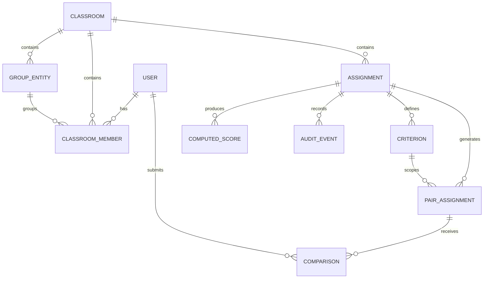
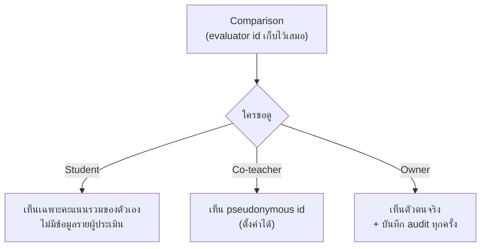

# Product Requirements Document — Pairwise

**ระบบประเมินผลนักศึกษาแบบ Pairwise Comparison**

| Field | Value |
|---|---|
| **Document ID** | PRD-PAIRWISE |
| **Version** | 2.0 |
| **Status** | Draft for Technical Design Review |
| **Last updated** | 2026-08-03 |
| **Document owner** | Course instructor (product owner) |
| **Required reviewers** | Tech lead, UX, Data privacy officer, Registrar/Academic affairs |
| **Supersedes** | v1.2 (June 2026) |

> **การใช้คำระดับความจำเป็น** เอกสารนี้ใช้คำตาม [RFC 2119](https://www.rfc-editor.org/rfc/rfc2119):
> **MUST** = บังคับ · **SHOULD** = ควรทำ เว้นแต่มีเหตุผลบันทึกไว้ · **MAY** = ทางเลือก
> ข้อความที่ขึ้นต้นด้วย ⚠️ คือจุดที่ยังต้องการการตัดสินใจจากผู้มีอำนาจ (ดู §17)

> **หมายเหตุสำหรับนักศึกษาในวิชานี้:** เอกสารนี้ทำหน้าที่สองอย่าง — เป็นโจทย์ project
> และเป็น **ตัวอย่างของ PRD ที่เขียนตามมาตรฐาน** ให้ดูว่า requirement ที่ testable ได้หน้าตาเป็นอย่างไร
> ทุก requirement มี ID เพื่อให้ trace ไปหา test ได้ (ดู §18 Traceability)

---

## สารบัญ

1. [Problem, Goals & Success Metrics](#1-problem-goals--success-metrics)
2. [Scope, Assumptions & Constraints](#2-scope-assumptions--constraints)
3. [Users & Personas](#3-users--personas)
4. [Glossary](#4-glossary)
5. [Key Design Decisions](#5-key-design-decisions)
6. [System Architecture](#6-system-architecture)
7. [Functional Requirements](#7-functional-requirements)
8. [Pairing Specification](#8-pairing-specification)
9. [Scoring Specification](#9-scoring-specification)
10. [Integrity & Quality Signals](#10-integrity--quality-signals)
11. [Data Model](#11-data-model)
12. [API Surface](#12-api-surface)
13. [Non-Functional Requirements](#13-non-functional-requirements)
14. [Privacy, Security & Compliance](#14-privacy-security--compliance)
15. [Accessibility](#15-accessibility)
16. [Risks & Mitigations](#16-risks--mitigations)
17. [Open Questions](#17-open-questions)
18. [Traceability](#18-traceability)
19. [Release Plan](#19-release-plan)
20. [References](#20-references)
21. [Change Log](#21-change-log)

---

## 1. Problem, Goals & Success Metrics

### 1.1 Problem Statement

การให้คะแนนงานกลุ่มในระดับอุดมศึกษามีปัญหาที่รู้กันมานาน 3 ข้อ:

| ปัญหา | อาการที่สังเกตได้ |
|---|---|
| **Absolute scoring bias** | อาจารย์ให้คะแนนงานชิ้นแรกกับชิ้นสุดท้ายด้วยมาตรฐานต่างกัน และ anchor กับงานที่เพิ่งตรวจไป |
| **Free-rider problem** | สมาชิกที่ไม่ทำงานได้คะแนนเท่ากับคนที่ทำ เพราะคะแนนผูกกับกลุ่ม |
| **Peer rating inflation** | เมื่อให้นักศึกษาให้คะแนนเพื่อนเป็นตัวเลข ส่วนใหญ่ให้คะแนนเต็มหมด ทำให้ข้อมูลไม่มีค่าในการแยกแยะ |

**สมมติฐานของผลิตภัณฑ์:** การเปรียบเทียบ *สองสิ่งพร้อมกัน* ("A หรือ B ดีกว่า") เป็นงานที่มนุษย์
ทำได้แม่นและสม่ำเสมอกว่าการให้คะแนนเดี่ยว ("A ได้กี่คะแนน") ระบบจึงเก็บเฉพาะ
การเปรียบเทียบคู่ แล้วสังเคราะห์เป็นคะแนนภายหลัง

### 1.2 Goals

| # | Goal |
|---|---|
| G1 | ลดอคติจากการให้คะแนนเดี่ยว โดยเก็บข้อมูลเป็น pairwise comparison เท่านั้น |
| G2 | แยกแยะผลงานรายบุคคลภายในกลุ่มได้อย่างมีหลักฐาน |
| G3 | ให้อาจารย์ตรวจสอบและแทรกแซงผลได้ทุกจุด (ระบบไม่ตัดเกรดเอง) |
| G4 | ปกป้องความเป็นส่วนตัวของผู้ประเมิน เพื่อให้กล้าประเมินตามจริง |
| G5 | ใช้เวลาของนักศึกษาไม่เกิน 15 นาทีต่อ assignment |

### 1.3 Non-Goals (v1.0)

- ไม่แทนที่ LMS — ไม่ทำ assignment submission, ไฟล์งาน, หรือ gradebook หลัก
- ไม่ตัดเกรด (letter grade) — ส่งออกเป็นคะแนนดิบให้อาจารย์นำไปใช้ต่อ
- ไม่ทำ rubric-based absolute scoring
- ไม่รองรับการประเมินข้าม classroom

### 1.4 Success Metrics

วัดหลังใช้จริง 1 ภาคการศึกษา

| # | Metric | Target | วิธีวัด |
|---|---|---|---|
| M1 | **Participation rate** — นักศึกษาที่ submit ครบตามที่ได้รับมอบหมาย | ≥ 90% | ระบบนับเอง |
| M2 | **Median time-on-task** ต่อ assignment | ≤ 15 นาที | เวลาจากเปิดหน้าแรกถึง submit สุดท้าย |
| M3 | **Score dispersion** ของ individual score ภายในกลุ่ม | SD ≥ 0.5 คะแนน (จาก 5) | เทียบกับระบบให้คะแนนตรงในเทอมก่อน |
| M4 | **Instructor override rate** — สัดส่วนคะแนนที่อาจารย์ต้องแก้ด้วยมือ | ≤ 5% | นับจาก audit log |
| M5 | **Dispute rate** — คำร้องอุทธรณ์คะแนน | ≤ 3% ของนักศึกษา | นับจากระบบอุทธรณ์ (§7.10) |
| M6 | **Low-confidence items** — item ที่ได้ comparison ไม่ถึงเกณฑ์ | ≤ 5% | รายงาน §10.1 |

> M3 คือ metric ที่สำคัญที่สุด — ถ้าคะแนนรายบุคคลยังกระจุกเท่ากันหมด
> แปลว่าผลิตภัณฑ์ยังไม่แก้ปัญหาที่ตั้งใจจะแก้ ไม่ว่า metric อื่นจะสวยแค่ไหน

---

## 2. Scope, Assumptions & Constraints

### 2.1 In Scope (v1.0)

Classroom & roster management · Assignment lifecycle · Pairing engine · Evaluation UI (group + individual)
· Scoring engine · Instructor reports & export · Anonymity controls · Audit log · Appeals intake

### 2.2 Out of Scope (v1.0)

| ไม่ทำใน v1.0 | เหตุผล | พิจารณาใหม่เมื่อ |
|---|---|---|
| LMS integration (LTI 1.3) | ยังไม่รู้ว่ามหาวิทยาลัยใช้ LMS ตัวไหน | หลัง pilot |
| Mobile native app | responsive web เพียงพอสำหรับงาน 15 นาที | ถ้า mobile traffic > 60% |
| Multi-language UI | ผู้ใช้กลุ่มแรกเป็นไทยทั้งหมด | มีคลาส international |
| Bradley–Terry / Elo model | ต้องการความโปร่งใสของสูตร มากกว่าความแม่นทางสถิติ | ดู §9.6 |
| Rubric attachment ต่อ criteria | เพิ่ม scope UI มาก | หลัง pilot |

### 2.3 Assumptions

| # | Assumption | ถ้าผิดจะกระทบอะไร |
|---|---|---|
| A1 | นักศึกษาทุกคนมี Google account ที่มหาวิทยาลัยออกให้ | ต้องเพิ่ม auth provider |
| A2 | ขนาดกลุ่มอยู่ที่ 3–8 คน | สูตร individual pairing ต้องออกแบบใหม่ (§8.3) |
| A3 | 1 classroom ≤ 200 นักศึกษา และ ≤ 40 กลุ่ม | ต้องทบทวน performance budget |
| A4 | อาจารย์ยอมรับว่าคะแนนสุดท้ายเป็นสิทธิ์ของอาจารย์ ไม่ใช่ของระบบ | ต้องออกแบบ governance ใหม่ |
| A5 | นักศึกษาเห็นงานของกลุ่มอื่นได้จริง (มี presentation/demo) | Group evaluation ไม่มีความหมาย |

> A5 สำคัญมากและมักถูกมองข้าม — **นักศึกษาประเมินสิ่งที่ตัวเองไม่เคยเห็นไม่ได้**
> ระบบ MUST บันทึกว่า assignment นั้นมี "artifact" อะไรให้ดู (link/URL) และแสดงคู่กับทุก comparison

### 2.4 Constraints

- **C1** — ต้อง deploy บน infrastructure ของมหาวิทยาลัยหรือ cloud ที่ผ่านการอนุมัติ
- **C2** — ข้อมูลนักศึกษาอยู่ภายใต้ พ.ร.บ. คุ้มครองข้อมูลส่วนบุคคล พ.ศ. 2562 (PDPA) — ดู §14
- **C3** — งบพัฒนา = 1 ภาคการศึกษาของทีมนักศึกษา 4–6 คน → scope ต้องคุมเข้ม

---

## 3. Users & Personas

| Role | Persona | Job to be done | ความถี่การใช้ |
|---|---|---|---|
| **Instructor (Owner)** | อ.สมชาย — สอน 2 วิชา รวม 180 คน | ตั้ง assignment, ดูรายงาน, ตัดสินคะแนนสุดท้าย | 2–3 ครั้ง/ภาคเรียน หนักช่วง deadline |
| **Instructor (Co-teacher)** | อ.ปรียา — ช่วยตรวจ | ประเมินเพิ่มบางคู่, ดูรายงาน | ตามที่ owner ขอ |
| **Teaching Assistant** | TA — ดูแล roster | นำเข้ารายชื่อ, ตอบคำถามนักศึกษา | รายสัปดาห์ |
| **Student** | น้องนก — ปี 3 ใช้มือถือเป็นหลัก | ประเมินให้เสร็จเร็ว, ดูคะแนนตัวเอง | 2–3 ครั้ง/ภาคเรียน |

**Role permission matrix** (บังคับใช้ฝั่ง server ทุกครั้ง — ดู FR-AUTHZ-01)

| ความสามารถ | Owner | Co-teacher | TA | Student |
|---|:---:|:---:|:---:|:---:|
| สร้าง/ลบ Classroom | ✅ | ❌ | ❌ | ❌ |
| จัดการ roster | ✅ | ✅ | ✅ | ❌ |
| สร้าง/แก้ Assignment | ✅ | ✅ | ❌ | ❌ |
| Finalize คะแนน | ✅ | ❌ | ❌ | ❌ |
| ประเมินในฐานะ instructor | ✅ | ✅ | ❌ | ❌ |
| ดู evaluator identity | ✅ | ⚠️ ดู §14.3 | ❌ | ❌ |
| Export ข้อมูล | ✅ | ✅ | ❌ | ❌ |
| ประเมิน (pairwise) | ✅ | ✅ | ❌ | ✅ |
| ดูคะแนนตัวเอง | — | — | — | ✅ |

---

## 4. Glossary

| Term | นิยาม |
|---|---|
| **Item** | สิ่งที่ถูกประเมิน — เป็น Group หรือ Student ก็ได้ |
| **Pair** | คู่ของ item ที่ไม่เรียงลำดับ `{a, b}` โดย a ≠ b |
| **Comparison** | ผลการเปรียบเทียบ 1 ครั้งของ 1 evaluator ต่อ 1 pair ต่อ 1 criterion |
| **Coverage (R)** | จำนวน comparison ที่ pair หนึ่งได้รับ |
| **Workload (k)** | จำนวน pair ที่ evaluator หนึ่งต้องประเมินต่อ criterion |
| **Quality index (q)** | ค่าเฉลี่ยถ่วงน้ำหนักของคะแนน pairwise ที่ item ได้รับ อยู่ในช่วง [0, 1] |
| **Evaluator weight (w)** | น้ำหนักของผู้ประเมิน 1 คน — student = 1.0, instructor = ตั้งค่าได้ |
| **Participation ratio (p)** | สัดส่วน comparison ที่ evaluator ส่งจริง ต่อที่ได้รับมอบหมาย |
| **Interim score** | คะแนนระหว่างทาง ยังเปลี่ยนได้ |
| **Final score** | คะแนนหลัง instructor กด Finalize — ล็อคแล้ว |

---

## 5. Key Design Decisions

ทุกข้อควรถูกยกไปเขียนเป็น ADR แยกตาม [adr.github.io](https://adr.github.io/)

| # | Decision | เหตุผล | ทางเลือกที่ไม่เลือก |
|---|---|---|---|
| **D1** | **6-point forced choice** ไม่มีตัวเลือก "เท่ากัน" | ตัวเลือกกลางทำให้เกิด central tendency bias — ผู้ประเมินเลือกกลางเมื่อไม่อยากคิด | 5-point มีตัวกลาง / binary A-B |
| **D2** | คะแนนดิบ map ผ่าน **band mapping** (floor 60% → ceiling 100%) ไม่ normalize ให้ผลรวม = 1 | การ normalize ให้ผลรวม = 1 ทำให้ทุกคนได้ ~1/N ซึ่งไม่มีความหมายเป็นคะแนน (ดู §9.3) | Sum-to-one / z-score / percentile rank |
| **D3** | **Coverage และ workload คำนวณจากกันและกัน** ไม่ fix ที่ 5 ทั้งคู่ | สองค่านี้ผูกกันทางคณิตศาสตร์ กำหนดตายตัวทั้งคู่จะ infeasible (ดู §8.2) | fix k=5 ตายตัว |
| **D4** | **Individual coverage = m − 2** ตามขนาดกลุ่ม ไม่บังคับ 5 | ในกลุ่ม m คน pair หนึ่งมีคนประเมินได้แค่ m−2 คน — บังคับ 5 คือเป็นไปไม่ได้เมื่อ m < 7 | บังคับ coverage 5 ทุกกลุ่ม |
| **D5** | **แยก "คะแนนที่ได้รับ" ออกจาก "โทษการไม่เข้าร่วม"** | เป็นคนละเรื่อง — การไม่ประเมินเพื่อนไม่ได้แปลว่างานตัวเองแย่ | ให้ 0 รวบ |
| **D6** | **Instructor weight เป็น float ใน weighted mean** ไม่ใช่การนับ vote ซ้ำ | รองรับค่าทศนิยม และไม่บิด comparison count | duplicate votes |
| **D7** | **k-anonymity threshold** ก่อนแสดงคะแนนรายบุคคล | ในกลุ่ม 3 คน การเห็นคะแนนทันทีทำให้เดาได้ว่าใครให้ | แสดงทันทีเสมอ |
| **D8** | **สลับตำแหน่งซ้าย-ขวาแบบสุ่ม** ในทุก comparison | ผู้ประเมินมี position bias เอนไปทางฝั่งใดฝั่งหนึ่งอย่างเป็นระบบ | แสดงตามลำดับ id |

---

## 6. System Architecture



**หลักการทางสถาปัตยกรรม**

- **AR-01** — Scoring Engine MUST เป็น pure function ของข้อมูลใน database (ไม่มี state ภายใน)
  เพื่อให้คำนวณซ้ำแล้วได้ผลเดิมเสมอ และ audit ได้
- **AR-02** — ทุกการอ่านข้อมูลที่ระบุตัวตนผู้ประเมิน MUST ผ่าน authorization layer เดียวกัน
- **AR-03** — Audit log MUST เป็น append-only และแยก storage จาก operational data

---

## 7. Functional Requirements

รูปแบบ ID: `FR-<โมดูล>-<เลข>` · Priority ใช้ MoSCoW: **M**ust / **S**hould / **C**ould

### 7.1 Authentication & Authorization

| ID | Pri | Requirement | Acceptance Criteria |
|---|:---:|---|---|
| FR-AUTH-01 | M | Login ผ่าน Google OAuth 2.0 / OIDC เท่านั้น ไม่มี local password | Given ผู้ใช้ยังไม่ login, When เปิดหน้าใด ๆ, Then redirect ไปหน้า Google consent |
| FR-AUTH-02 | M | ระบบ MUST จำกัด hosted domain (`hd`) ที่ยอมรับได้ ตั้งค่าต่อ classroom | Given อีเมลนอก domain ที่อนุญาต, When login, Then ปฏิเสธพร้อมข้อความชัดเจน |
| FR-AUTH-03 | M | จับคู่ผู้ใช้กับ roster ด้วย **email ที่ normalize แล้ว** (lowercase, ตัด dot ใน gmail, ตัด `+tag`) | Given roster มี `Somchai.A+x@uni.ac.th`, When login ด้วย `somchaia@uni.ac.th`, Then จับคู่สำเร็จ |
| FR-AUTH-04 | M | Session หมดอายุใน 12 ชั่วโมง และ refresh ได้เงียบ ๆ | — |
| FR-AUTHZ-01 | M | ทุก API MUST ตรวจสิทธิ์ฝั่ง server ตาม role matrix §3 — ห้ามพึ่ง UI ในการซ่อน | Given student เรียก `GET /assignments/{id}/raw-pairs` ตรง ๆ, Then ได้ 403 |
| FR-AUTHZ-02 | M | ทุก resource access MUST ตรวจว่า resource นั้นอยู่ใน classroom ที่ผู้ใช้สังกัด | Given student ของ classroom A ขอ resource ของ classroom B, Then ได้ 404 (ไม่ใช่ 403 เพื่อไม่รั่วว่ามีอยู่จริง) |
| FR-AUTHZ-03 | S | 1 คนเป็น instructor ในหลาย classroom และเป็น student ใน classroom อื่นได้ | — |

### 7.2 Classroom & Roster

| ID | Pri | Requirement | Acceptance Criteria |
|---|:---:|---|---|
| FR-CLASS-01 | M | Instructor สร้าง classroom และนำเข้ารายชื่อผ่าน CSV: `email`, `group_name`, `student_id` (optional), `display_name` (optional) | header ต้องตรง ไม่สนตัวพิมพ์เล็กใหญ่ |
| FR-CLASS-02 | M | CSV import MUST เป็น **atomic** — ถ้ามีแถวใดผิด ให้ reject ทั้งไฟล์พร้อมรายงานแถวที่ผิด | Given CSV 100 แถว มีแถว 42 อีเมลผิดรูปแบบ, Then ไม่มีแถวไหนถูกบันทึก และรายงานระบุ "row 42" |
| FR-CLASS-03 | M | ระบบ MUST ตรวจ: อีเมลซ้ำ, อีเมลผิดรูปแบบ, group_name ว่าง, กลุ่มที่มีสมาชิก < 2 | รายงานเตือนแยกตามประเภท |
| FR-CLASS-04 | M | อีเมลที่ยังไม่เคย login → สร้าง user สถานะ `PENDING` และ activate อัตโนมัติเมื่อ login ครั้งแรก | — |
| FR-CLASS-05 | S | รองรับ CSV แบบ **upsert** — import ซ้ำเพื่อแก้ไขกลุ่มโดยไม่ลบข้อมูลเดิม | ต้องแสดง diff ก่อนยืนยัน |
| FR-CLASS-06 | M | Instructor เพิ่ม/ลบ co-teacher และ TA ได้ แต่ลบ owner คนสุดท้ายไม่ได้ | Given เหลือ owner คนเดียว, When ลบตัวเอง, Then ปฏิเสธ |
| FR-CLASS-07 | S | Archive classroom ได้ — read-only ไม่ปรากฏใน dashboard หลัก | — |

### 7.3 Assignment Lifecycle



| ID | Pri | Requirement |
|---|:---:|---|
| FR-ASSIGN-01 | M | Assignment MUST มี: ชื่อ, คำอธิบาย, artifact link (ดู A5), `group_max_score`, `individual_max_score`, deadline แยกของ group และ individual, timezone |
| FR-ASSIGN-02 | M | Criteria ของแต่ละฝั่ง MUST มีผลรวมน้ำหนัก = 100% (± 0.01) — validate ก่อน publish |
| FR-ASSIGN-03 | M | แก้ criteria, น้ำหนัก หรือ roster ได้เฉพาะสถานะ `DRAFT` — หลัง publish ต้อง unpublish ก่อน และระบบ MUST เตือนว่า comparison เดิมจะถูก invalidate |
| FR-ASSIGN-04 | M | ขยาย deadline ได้ทุกเมื่อ · ร่นเข้าได้เฉพาะเมื่อยังไม่ถึง deadline เดิม |
| FR-ASSIGN-05 | M | Deadline MUST เก็บเป็น UTC และแสดงตาม timezone ของ classroom |
| FR-ASSIGN-06 | S | Clone assignment จากของเดิมได้ (คัดลอก criteria และ config) |
| FR-ASSIGN-07 | M | `individual_max_score = 0` แปลว่าไม่มี individual evaluation — ระบบ MUST ไม่สร้าง pair ฝั่งนั้น |

### 7.4 Pairing Engine

รายละเอียดอัลกอริทึมอยู่ใน [§8](#8-pairing-specification)

| ID | Pri | Requirement |
|---|:---:|---|
| FR-PAIR-01 | M | สร้าง pair assignment ทั้งหมดตอน publish และเก็บลง database — ไม่สุ่มตอน runtime |
| FR-PAIR-02 | M | **Group eval:** evaluator MUST ไม่ได้รับ pair ที่มีกลุ่มตัวเองอยู่ |
| FR-PAIR-03 | M | **Individual eval:** evaluator MUST ไม่ได้รับ pair ที่มีตัวเองอยู่ และประเมินได้เฉพาะภายในกลุ่มตัวเอง |
| FR-PAIR-04 | M | ระบบ MUST คำนวณ feasibility ก่อน publish และแสดงให้อาจารย์เห็น: coverage ที่ทำได้จริง, workload ต่อคน, จำนวน comparison รวม |
| FR-PAIR-05 | M | ถ้า coverage เป้าหมายเป็นไปไม่ได้ ระบบ MUST ลดลงมาที่ค่าสูงสุดที่ทำได้ และ **แจ้งเหตุผลเป็นตัวเลข** ไม่ใช่แค่เตือนลอย ๆ |
| FR-PAIR-06 | M | การกระจาย pair MUST balanced — ส่วนต่างของ coverage ระหว่าง pair ใด ๆ ≤ 1 |
| FR-PAIR-07 | M | evaluator คนเดียวกัน MUST ไม่ได้รับ pair เดิมซ้ำภายใน criterion เดียวกัน |
| FR-PAIR-08 | M | ตำแหน่งซ้าย/ขวาของแต่ละ pair MUST สุ่มและบันทึกไว้ (ดู D8) |
| FR-PAIR-09 | M | Pairing MUST deterministic เมื่อให้ seed เดิม — เพื่อให้ reproduce ปัญหาได้ |
| FR-PAIR-10 | M | Instructor สั่ง "ส่งประเมินเพิ่ม" ต่อ pair ได้ โดยระบุจำนวนคน — ระบบสุ่มจาก evaluator ที่ยังไม่เคยประเมิน pair นั้น |
| FR-PAIR-11 | M | เปลี่ยนกลุ่มหลัง publish MUST ทำผ่าน unpublish → แก้ → publish ใหม่ พร้อม audit และแจ้งนักศึกษาทุกคนที่ได้รับผลกระทบ |

### 7.5 Evaluation UI

| ID | Pri | Requirement | Acceptance Criteria |
|---|:---:|---|---|
| FR-EVAL-01 | M | หน้า Group Evaluation แสดงทุก criterion ในหน้าเดียว แบ่งเป็น section | — |
| FR-EVAL-02 | M | แต่ละ comparison แสดงชื่อ item สองฝั่ง + link ไป artifact ของทั้งคู่ | Given ไม่มี artifact link, Then แสดงข้อความว่าอาจารย์ยังไม่ได้ระบุ |
| FR-EVAL-03 | M | ใช้ **6-point forced choice** ไม่มีตัวเลือกกลาง (ดู D1) พร้อม label ข้อความทุกปุ่ม ไม่ใช่แค่ตัวเลข | ทุก radio มี accessible name |
| FR-EVAL-04 | M | Autosave draft ทุกครั้งที่เปลี่ยนคำตอบ (debounce ≤ 2 วินาที) และแสดงสถานะ "บันทึกแล้ว เมื่อ HH:MM" | Given ปิด browser กลางคัน, When เปิดใหม่, Then คำตอบเดิมยังอยู่ |
| FR-EVAL-05 | M | ปุ่ม Submit เปิดใช้ได้ตลอด แม้ตอบไม่ครบ — แต่แสดงจำนวนที่ยังไม่ตอบก่อนยืนยัน | — |
| FR-EVAL-06 | M | **Re-submit ได้ไม่จำกัดครั้งก่อน deadline** ระบบใช้ submission ล่าสุดในการคำนวณ และเก็บทุกเวอร์ชันไว้ | Given submit 3 ครั้ง, Then คะแนนใช้ครั้งที่ 3 และ audit log มี 3 records |
| FR-EVAL-07 | M | แสดง progress `X / Y` ต่อ criterion และรวมทั้งหน้า |
| FR-EVAL-08 | M | หลัง deadline ระบบ MUST ปิดการ submit และแสดงคำตอบแบบ read-only |
| FR-EVAL-09 | M | Draft ที่ไม่เคย submit MUST ไม่ถูกนำมาคำนวณ (แต่ยังแสดงให้เจ้าตัวเห็นเพื่อความโปร่งใส) |
| FR-EVAL-10 | S | แสดง countdown เมื่อเหลือ < 48 ชั่วโมง |
| FR-EVAL-11 | M | หน้า Individual Evaluation แยกจาก Group และมีปุ่ม submit ของตัวเอง |
| FR-EVAL-12 | M | ถ้ากลุ่มมีสมาชิก ≤ 2 คน MUST ไม่แสดงหน้า Individual Evaluation และอธิบายเหตุผล (§8.3) |
| FR-EVAL-13 | S | รองรับการทำงานต่อเนื่องเมื่อเน็ตหลุดชั่วคราว — queue คำตอบไว้ใน client แล้ว sync เมื่อกลับมา |

**รูปแบบหน้าจอ (mobile-first)**

```
┌─────────────────────────────────────┐
│ User Experience          3 / 5 ✓    │
├─────────────────────────────────────┤
│  กลุ่ม Aurora        กลุ่ม Borealis  │
│  [ดูผลงาน ↗]         [ดูผลงาน ↗]    │
│                                     │
│  ◯───◯───◯───◯───◯───◯              │
│  ↑                       ↑          │
│  ซ้ายดีกว่ามาก      ขวาดีกว่ามาก     │
│                                     │
│  1 ซ้ายดีกว่ามาก   4 ขวาดีกว่าเล็กน้อย│
│  2 ซ้ายดีกว่า      5 ขวาดีกว่า       │
│  3 ซ้ายดีกว่าเล็กน้อย 6 ขวาดีกว่ามาก  │
└─────────────────────────────────────┘
```

### 7.6 Scoring Engine

รายละเอียดสูตรอยู่ใน [§9](#9-scoring-specification)

| ID | Pri | Requirement |
|---|:---:|---|
| FR-SCORE-01 | M | คำนวณ quality index `q` ต่อ (item, criterion) เป็น weighted mean ตาม §9.2 |
| FR-SCORE-02 | M | Map `q` เป็นคะแนนด้วย band mapping ตาม §9.3 โดย floor/ceiling ตั้งค่าได้ต่อ assignment |
| FR-SCORE-03 | M | `instructor_weight` เป็น float ≥ 0 default 1.0 ตั้งค่าต่อ assignment ใช้ค่าเดียวกันทั้ง group และ individual |
| FR-SCORE-04 | M | Participation multiplier คำนวณและใช้แยกจากคะแนนที่ได้รับ ตาม §9.4 |
| FR-SCORE-05 | M | Item ที่มี comparison < `min_comparisons` (default 3) MUST ถูก flag `LOW_CONFIDENCE` และไม่ finalize อัตโนมัติ |
| FR-SCORE-06 | M | Interim score คำนวณใหม่ทุกวันเวลา 02:00 ตาม timezone ของ classroom และ on-demand เมื่ออาจารย์กด |
| FR-SCORE-07 | M | คะแนนที่ยังไม่ finalize MUST แสดง label "ชั่วคราว — อาจเปลี่ยนแปลงได้" ทุกที่ที่ปรากฏ |
| FR-SCORE-08 | M | Instructor override คะแนนรายบุคคล/รายกลุ่มได้ พร้อม **บังคับกรอกเหตุผล** และบันทึก audit |
| FR-SCORE-09 | M | Finalize MUST snapshot ทั้ง input และ output ของการคำนวณ เพื่อให้ตรวจย้อนหลังได้แม้สูตรเปลี่ยน |
| FR-SCORE-10 | M | การคำนวณ MUST reproducible — รันซ้ำบนข้อมูลชุดเดิม ต้องได้ผลเท่าเดิมทุกหลักทศนิยม |

### 7.7 Reports

| ID | Pri | Requirement |
|---|:---:|---|
| FR-REPORT-01 | M | Group Summary: กลุ่ม × criterion × (q, comparison count, คะแนนถ่วงน้ำหนัก, flag) |
| FR-REPORT-02 | M | Individual Summary: นักศึกษา × criterion × (q, count, คะแนน, participation, คะแนนรวม, flag) |
| FR-REPORT-03 | M | Pair Coverage Report: ทุก pair, coverage จริง, ค่าเฉลี่ยผล, ปุ่ม "ส่งประเมินเพิ่ม" และ "ประเมินเอง" |
| FR-REPORT-04 | M | Quality Report: รายการ flag ทั้งหมดจาก §10 พร้อมคำอธิบายว่าควรทำอะไรต่อ |
| FR-REPORT-05 | S | Distribution chart ของคะแนนต่อ criterion เพื่อให้อาจารย์เห็นการกระจาย |
| FR-REPORT-06 | M | นักศึกษาเห็นเฉพาะ: คะแนนกลุ่มตัวเอง, คะแนนรายบุคคลตัวเอง, participation ตัวเอง — ไม่เห็นของคนอื่นทุกกรณี |

### 7.8 Export

| ID | Pri | Requirement |
|---|:---:|---|
| FR-EXPORT-01 | M | Export CSV (UTF-8 with BOM เพื่อให้ Excel ภาษาไทยไม่เพี้ยน) และ XLSX |
| FR-EXPORT-02 | M | XLSX MUST มี 4 sheet: Group Summary, Individual Summary, Pair Coverage, Metadata (สูตร/config/เวลา export) |
| FR-EXPORT-03 | M | Raw comparison export MUST ใช้ **pseudonymous evaluator id** เป็นค่า default |
| FR-EXPORT-04 | M | การ export ที่มี evaluator identity จริง MUST ทำได้เฉพาะ Owner, ต้องยืนยันเจตนา, และบันทึก audit |
| FR-EXPORT-05 | M | ชื่อไฟล์: `{classroom_slug}_{assignment_slug}_{report}_{YYYYMMDD-HHmm}.{ext}` |
| FR-EXPORT-06 | S | Metadata sheet MUST ระบุเวอร์ชันของสูตรคำนวณ เพื่อให้ไฟล์เก่าอ่านเข้าใจได้ |

### 7.9 Notifications

| ID | Pri | Event | ผู้รับ |
|---|:---:|---|---|
| FR-NOTIF-01 | M | Assignment เปิดให้ประเมิน | นักศึกษาทุกคน |
| FR-NOTIF-02 | M | เหลือ 48 ชม. และยังไม่ submit ครบ | นักศึกษาที่เกี่ยว |
| FR-NOTIF-03 | M | Pairs ถูก re-generate | นักศึกษาที่ได้รับผลกระทบ |
| FR-NOTIF-04 | M | คะแนน finalize แล้ว | นักศึกษาทุกคน |
| FR-NOTIF-05 | S | ได้รับมอบหมายให้ประเมินเพิ่ม | นักศึกษาที่ถูกเลือก |
| FR-NOTIF-06 | M | ทุก notification MUST มีลิงก์ตรงไปหน้าที่ต้องทำ และ MUST ไม่มีคะแนนของใครอยู่ในเนื้อความ |

### 7.10 Appeals & Audit

| ID | Pri | Requirement |
|---|:---:|---|
| FR-APPEAL-01 | S | นักศึกษายื่นอุทธรณ์คะแนนได้ภายใน 7 วันหลัง finalize พร้อมข้อความอธิบาย |
| FR-APPEAL-02 | S | Instructor เห็นรายการอุทธรณ์ ตอบกลับ และเลือกที่จะ override หรือยืนยันคะแนนเดิม |
| FR-AUDIT-01 | M | ระบบ MUST บันทึก audit สำหรับ: publish/unpublish, pair regeneration, score override, finalize/reopen, export ที่มี identity, การเข้าถึง evaluator identity, การเปลี่ยน role |
| FR-AUDIT-02 | M | Audit record MUST มี: actor, action, resource, before/after, timestamp (UTC), IP, reason (ถ้าบังคับ) |
| FR-AUDIT-03 | M | Audit log MUST เป็น append-only — ไม่มี API ให้ลบหรือแก้ |

---

## 8. Pairing Specification

### 8.1 นิยามและตัวแปร

| สัญลักษณ์ | ความหมาย |
|---|---|
| `S` | จำนวนนักศึกษาทั้งหมดใน classroom |
| `N` | จำนวนกลุ่ม |
| `m` | จำนวนสมาชิกในกลุ่มหนึ่ง |
| `P` | จำนวน pair ที่เป็นไปได้ |
| `R` | coverage เป้าหมาย (default 5) |
| `k` | workload ต่อ evaluator ต่อ criterion |
| `k_max` | เพดาน workload เพื่อคุมเวลาของนักศึกษา (default 8) |

### 8.2 Group Evaluation — Feasibility

```
P            = C(N, 2) = N(N-1)/2
slots_needed = P × R
k            = ceil(slots_needed / S)

ข้อจำกัด:
(1) k ≤ P − (N − 1)          ← evaluator ประเมิน pair ที่มีกลุ่มตัวเองไม่ได้
(2) k ≤ k_max                 ← เพดานเวลาของนักศึกษา
(3) R ≤ min over pairs of (S − |a| − |b|)   ← คนที่มีสิทธิ์ประเมิน pair นั้น
```

ถ้าข้อใดไม่ผ่าน ระบบ MUST ลด `R` ลงจนกว่าจะผ่านทุกข้อ แล้วรายงานค่าที่ใช้จริง

**ตัวอย่างที่ 1 — ห้องใหญ่ (feasible แบบเหลือเฟือ)**

```
S = 200, N = 10 (กลุ่มละ 20), R = 5
P = 45 → slots = 225 → k = ceil(225/200) = 2
ตรวจ (1): 2 ≤ 45 − 9 = 36 ✅   (2): 2 ≤ 8 ✅   (3): 5 ≤ 200−40 = 160 ✅
ผล: นักศึกษาแต่ละคนประเมิน 2 คู่/criterion → 3 criteria = 6 comparisons
```

**ตัวอย่างที่ 2 — ห้องเล็ก (infeasible ต้องลด R)**

```
S = 12, N = 3 (กลุ่มละ 4), R = 5
P = 3 → slots = 15 → k = ceil(15/12) = 2
ตรวจ (1): 2 ≤ 3 − 2 = 1 ❌  → ไม่ผ่าน

ลด R:
R = 4 → slots = 12 → k = 1 → 1 ≤ 1 ✅
ตรวจ (3): pair (a,b) มีคนประเมินได้ 12 − 4 − 4 = 4 คน → R ≤ 4 ✅

ผล: R = 4 (ไม่ใช่ 5), k = 1
ข้อความที่แสดงต่ออาจารย์:
  "ห้องนี้มี 3 กลุ่ม แต่ละคู่มีผู้มีสิทธิ์ประเมินเพียง 4 คน
   จึงตั้ง coverage ได้สูงสุด 4 ครั้งต่อคู่ (ไม่ใช่ 5 ตามค่าตั้งต้น)
   นักศึกษาแต่ละคนจะได้ 1 คู่ต่อเกณฑ์"
```

> ⚠️ ข้อความแบบตัวอย่างที่ 2 คือสิ่งที่แยกระบบที่ใช้ได้จริงออกจากระบบที่พังเงียบ ๆ —
> ระบบ MUST ไม่แอบลดค่าโดยไม่บอก และ MUST ไม่พยายามให้ evaluator ประเมิน pair เดิมซ้ำเพื่อปั๊มตัวเลข

### 8.3 Individual Evaluation — Complete Design

ภายในกลุ่มขนาด `m` การออกแบบเป็น **complete enumeration** ไม่ต้องสุ่ม:

```
pairs ทั้งหมดในกลุ่ม        = C(m, 2)
pairs ที่ evaluator 1 คนทำได้ = C(m−1, 2)      ← ตัด pair ที่มีตัวเองออก
coverage ที่ได้จริง          = m − 2           ← คนที่ประเมิน pair (a,b) ได้

ตรวจสอบความสอดคล้อง:  m × C(m−1,2) = C(m,2) × (m−2)  ✓ เป็นจริงเสมอ
```

| ขนาดกลุ่ม `m` | pairs ทั้งหมด | pairs ต่อคน | **coverage สูงสุด** | สถานะ |
|:---:|:---:|:---:|:---:|---|
| 2 | 1 | 0 | 0 | ❌ ทำ individual eval ไม่ได้ |
| 3 | 3 | 1 | 1 | ⚠️ coverage ต่ำมาก ผลไม่น่าเชื่อถือ |
| 4 | 6 | 3 | 2 | ⚠️ พอใช้ |
| **5** | 10 | 6 | 3 | ✅ **แนะนำ** |
| **6** | 15 | 10 | 4 | ✅ **แนะนำ** |
| 7 | 21 | 15 | 5 | ✅ ถึงเป้า R=5 พอดี |
| 8 | 28 | 21 | 6 | ⚠️ ภาระ 21 คู่/criterion สูงเกินไป |

**ข้อกำหนดที่ตามมา**

- **FR-PAIR-12 (M)** — `m ≤ 2` → ไม่มี individual evaluation, แสดงเหตุผลให้นักศึกษาทราบ
- **FR-PAIR-13 (M)** — `m = 3` → สร้าง pair ได้ แต่ MUST flag ผลลัพธ์เป็น `LOW_CONFIDENCE` เสมอ
- **FR-PAIR-14 (M)** — ถ้า `C(m−1,2) > k_max` ระบบ MUST สุ่มเลือก `k_max` pairs ต่อ criterion
  โดยรักษาสมดุลของ coverage และรายงานว่า coverage จริงลดลงเหลือเท่าไร
- **FR-PAIR-15 (S)** — ตอนสร้าง classroom ระบบ SHOULD เตือนถ้าขนาดกลุ่มอยู่นอกช่วง 4–7

### 8.4 อัลกอริทึมการจัดสรร

```
generate_group_pairs(classroom, assignment, criterion, seed):
    rng          = seeded_rng(seed, assignment.id, criterion.id)
    all_pairs    = [ {a,b} for a,b in combinations(groups, 2) ]
    R, k         = solve_feasibility(...)            # §8.2
    demand       = { pair: R for pair in all_pairs }

    # เรียง evaluator แบบสุ่ม เพื่อไม่ให้กลุ่มแรก ๆ ได้เปรียบเสมอ
    for evaluator in shuffle(students, rng):
        eligible = [ p for p in all_pairs
                     if evaluator.group not in p
                     and p not in evaluator.already_assigned ]

        # เลือก pair ที่ยัง "ขาด" มากที่สุดก่อน → balanced coverage
        eligible.sort(key=lambda p: (-demand[p], rng.next()))
        chosen = eligible[:k]

        assign(evaluator, chosen, position=rng.coin_flip())   # FR-PAIR-08
        for p in chosen: demand[p] -= 1

    assert max(coverage) - min(coverage) <= 1        # FR-PAIR-06
    return assignments
```

**Invariants ที่ MUST เป็นจริงเสมอ** (เหมาะเป็น property-based test)

| # | Invariant |
|---|---|
| INV-1 | ไม่มี evaluator ได้รับ pair ที่มีตัวเอง/กลุ่มตัวเองอยู่ |
| INV-2 | ไม่มี evaluator ได้รับ pair เดิมซ้ำใน criterion เดียวกัน |
| INV-3 | `max(coverage) − min(coverage) ≤ 1` |
| INV-4 | จำนวน pair ที่ evaluator แต่ละคนได้รับ ต่างกันไม่เกิน 1 |
| INV-5 | seed เดิม + input เดิม → ผลลัพธ์เดิมทุกครั้ง |

---

## 9. Scoring Specification

### 9.1 จาก Comparison เป็น Point

**6-point forced choice** (D1) — ไม่มีตัวเลือก "เท่ากัน"

| ตัวเลือก | ความหมาย | `s_left` | `s_right` |
|:---:|---|:---:|:---:|
| 1 | ซ้ายดีกว่ามาก | 1.0 | 0.0 |
| 2 | ซ้ายดีกว่า | 0.8 | 0.2 |
| 3 | ซ้ายดีกว่าเล็กน้อย | 0.6 | 0.4 |
| 4 | ขวาดีกว่าเล็กน้อย | 0.4 | 0.6 |
| 5 | ขวาดีกว่า | 0.2 | 0.8 |
| 6 | ขวาดีกว่ามาก | 0.0 | 1.0 |

> เก็บทั้งค่าที่ผู้ใช้เลือก **และ** ตำแหน่งซ้าย/ขวาที่แสดงจริง เพื่อแปลงกลับเป็น item ได้ถูกต้อง
> (FR-PAIR-08 สุ่มตำแหน่ง — ถ้าไม่เก็บ ข้อมูลจะแปลผลผิดทั้งชุด)

### 9.2 Quality Index

สำหรับ item `i` ใน criterion `c`:

```
q(i,c) = Σ_e ( w_e × s_{i,e} )  /  Σ_e ( w_e )

โดย  e     = ทุก comparison ที่ i ปรากฏอยู่ และมีสถานะ SUBMITTED
      w_e   = 1.0 ถ้าผู้ประเมินเป็น student
            = instructor_weight ถ้าเป็น instructor
      s_i,e = point ที่ i ได้จาก comparison นั้น (ตาราง §9.1)

q ∈ [0, 1]   และค่าเฉลี่ยของทุก item ในการออกแบบที่สมดุล ≈ 0.5
```

### 9.3 Band Mapping — จาก q เป็นคะแนน

> **ทำไมไม่ normalize ให้ผลรวม = 1** — ถ้ามี 10 กลุ่ม แต่ละกลุ่มจะได้ ~0.1
> คูณกับคะแนนเต็ม 15 = 1.5 คะแนน ซึ่งทุกกลุ่มตกหมด สูตรแบบนั้นวัด *สัดส่วนสัมพัทธ์*
> ไม่ใช่ *ระดับคุณภาพ* จึงใช้เป็นคะแนนโดยตรงไม่ได้ (ดู D2)

```
score_ratio(i,c) = floor + (ceiling − floor) × q(i,c)

default:  floor = 0.60,  ceiling = 1.00     (ตั้งค่าได้ต่อ assignment)

ผลที่ได้:  q = 0.0  → 60%
           q = 0.5  → 80%
           q = 1.0  → 100%
```

**ความหมายเชิงนโยบาย:** ทุกกลุ่มที่ส่งงาน ได้ฐาน 60% ของคะแนนส่วนนั้น
ส่วนที่เหลืออีก 40% คือช่วงที่ pairwise comparison ใช้จัดลำดับ
อาจารย์ปรับ floor ลงได้ถ้าต้องการให้แยกแยะแรงขึ้น

**คะแนนต่อ criterion**

```
weighted(i,c) = score_ratio(i,c) × weight_c × max_score_side

max_score_side = group_max_score หรือ individual_max_score
```

**คะแนนรวมของ item**

```
component(i) = Σ_c weighted(i,c)
```

### 9.4 Participation Multiplier

แยกจากคะแนนที่ได้รับโดยสิ้นเชิง (D5)

```
p_side = submitted_comparisons / assigned_comparisons     (แยก group / individual)
p      = (p_group × assigned_group + p_indiv × assigned_indiv)
         / (assigned_group + assigned_indiv)

M = min( 1.0 , p / completion_threshold )      completion_threshold default = 0.90

final_personal_score = ( group_component + individual_component ) × M
```

| p | M | ผล |
|:---:|:---:|---|
| 1.00 | 1.00 | ได้เต็มตามที่ประเมินได้ |
| 0.90 | 1.00 | ถึงเกณฑ์แล้ว |
| 0.45 | 0.50 | ได้ครึ่งเดียว |
| 0.00 | 0.00 | ได้ 0 |

- **FR-SCORE-11 (M)** — คะแนน **ของกลุ่ม** ไม่ถูกลดด้วย `M` ของสมาชิกคนใดคนหนึ่ง
  `M` มีผลเฉพาะคะแนนส่วนบุคคลของคนที่ไม่ประเมิน
- **FR-SCORE-12 (M)** — นโยบายนี้ MUST แสดงให้นักศึกษาเห็นตั้งแต่เปิด assignment ไม่ใช่มาบอกทีหลัง
- **FR-SCORE-13 (M)** — หน้าของนักศึกษา MUST แสดง `p` และ `M` ปัจจุบันแบบ real-time

> ⚠️ **การตัดสินใจที่ยังเปิดอยู่:** ควรใช้ `M` คูณคะแนนทั้งก้อน (ปัจจุบัน) หรือคูณเฉพาะส่วน individual
> หรือหักเป็นคะแนนคงที่ — ทางเลือกนี้เป็นเรื่องนโยบายวิชา ไม่ใช่เรื่องเทคนิค ดู OQ-2

### 9.5 Worked Example

**ตั้งค่า:** total 20 · group_max 15 · individual_max 5 · floor 0.60 · ceiling 1.00
Group criteria: UX 40%, Completeness 35%, Innovation 25%
Individual criteria: Teamwork 50%, Management 50%

**กลุ่ม Aurora**

| Criterion | q | score_ratio | น้ำหนัก | คะแนน |
|---|:---:|:---:|:---:|---:|
| UX | 0.72 | 0.60 + 0.40×0.72 = **0.888** | 40% × 15 = 6.0 | 5.328 |
| Completeness | 0.55 | **0.820** | 35% × 15 = 5.25 | 4.305 |
| Innovation | 0.61 | **0.844** | 25% × 15 = 3.75 | 3.165 |
| | | | **รวม** | **12.798 / 15** |

**นก (สมาชิก Aurora) — ประเมินครบ**

| Criterion | q | score_ratio | น้ำหนัก | คะแนน |
|---|:---:|:---:|:---:|---:|
| Teamwork | 0.68 | **0.872** | 50% × 5 = 2.5 | 2.180 |
| Management | 0.45 | **0.780** | 50% × 5 = 2.5 | 1.950 |
| | | | **รวม** | **4.130 / 5** |

```
p = 15/15 = 1.00 → M = 1.00
คะแนนสุดท้าย = (12.798 + 4.130) × 1.00 = 16.93 / 20
```

**ต้น (สมาชิก Aurora) — ประเมินไม่ครบ**

| Criterion | q | score_ratio | คะแนน |
|---|:---:|:---:|---:|
| Teamwork | 0.31 | 0.724 | 1.810 |
| Management | 0.35 | 0.740 | 1.850 |
| | | **รวม** | **3.660 / 5** |

```
group eval: submit 6 จาก 12 · individual eval: submit 3 จาก 3
p = (6 + 3) / (12 + 3) = 0.60
M = min(1.0, 0.60 / 0.90) = 0.667

คะแนนสุดท้าย = (12.798 + 3.660) × 0.667 = 10.97 / 20
```

สังเกตว่า **คะแนนกลุ่มยังเป็น 12.798 เท่าเดิม** — การที่ต้นไม่ประเมิน
ไม่ได้ทำให้เพื่อนร่วมกลุ่มเสียคะแนน

### 9.6 ทางเลือกที่พิจารณาแล้วไม่เลือก

| วิธี | ข้อดี | ทำไมไม่เลือกใน v1.0 |
|---|---|---|
| **Bradley–Terry model** ([อ้างอิง](https://en.wikipedia.org/wiki/Bradley%E2%80%93Terry_model)) | เป็นมาตรฐานทางสถิติของ pairwise ranking, จัดการ comparison ที่ไม่สมดุลได้ดี | อธิบายให้นักศึกษาเข้าใจยาก และการอุทธรณ์คะแนนจะตอบไม่ได้ว่า "ทำไมได้เท่านี้" |
| **Elo / TrueSkill** | อัปเดตทีละ comparison เหมาะกับ rolling score | ผลขึ้นกับ *ลำดับ* ของ comparison ซึ่งไม่ยุติธรรมในบริบทการให้เกรด |
| **z-score / percentile rank** | กระจายคะแนนชัด | บังคับให้มีคนได้คะแนนต่ำเสมอ แม้ทุกกลุ่มทำดีหมด |

> ทั้งสามวิธี SHOULD ถูกพิจารณาใหม่ใน v2.0 โดยเก็บข้อมูลดิบไว้ให้คำนวณย้อนหลังได้

---

## 10. Integrity & Quality Signals

ระบบ MUST คำนวณสัญญาณเหล่านี้และแสดงใน Quality Report (FR-REPORT-04)
**สัญญาณเหล่านี้เป็นข้อมูลให้อาจารย์ตัดสิน ไม่ใช่การลงโทษอัตโนมัติ**

| ID | สัญญาณ | นิยาม | เกณฑ์ default | การกระทำที่แนะนำ |
|---|---|---|---|---|
| QS-01 | **Low coverage** | comparison ที่ item ได้รับ < เกณฑ์ | < 3 | ใช้ "ส่งประเมินเพิ่ม" |
| QS-02 | **Straight-lining** | evaluator เลือกค่าเดิมเกินเกณฑ์ | > 80% ของคำตอบ | ทบทวนด้วยตา |
| QS-03 | **Position bias** | evaluator เลือกฝั่งซ้าย/ขวาไม่สมดุลอย่างมาก | > 80% ฝั่งเดียว | ทบทวนด้วยตา |
| QS-04 | **Intransitivity** | เกิดวง A>B, B>C, C>A ในคำตอบของคนเดียว | > 20% ของ triple ที่ตรวจได้ | อาจแปลว่าไม่ได้ดูผลงานจริง |
| QS-05 | **Speed run** | เวลาเฉลี่ยต่อ comparison ต่ำผิดปกติ | < 3 วินาที | ทบทวนด้วยตา |
| QS-06 | **Self-group favoritism** | (individual) evaluator ให้เพื่อนสนิทกลุ่มเดิมสูงผิดปกติ | z > 2 | ทบทวนด้วยตา |
| QS-07 | **Low rater agreement** | ความเห็นแตกกันมากใน criterion | Kendall's W < 0.2 | criterion อาจกำกวม ต้องแก้คำอธิบาย |

- **FR-QS-01 (M)** — ระบบ MUST ไม่ลบหรือลดน้ำหนักคำตอบใดโดยอัตโนมัติจากสัญญาณเหล่านี้
- **FR-QS-02 (S)** — Instructor MAY ทำเครื่องหมาย comparison ว่า `EXCLUDED` พร้อมเหตุผล และระบบคำนวณใหม่
- **FR-QS-03 (M)** — QS-07 ที่ต่ำติดต่อกันหลาย assignment SHOULD ถูกรายงานเป็น feedback ว่า criterion นั้นเขียนไม่ชัด

---

## 11. Data Model



### 11.1 ตารางหลัก

```
user
  id, email_normalized (UNIQUE), email_raw, display_name,
  google_sub (UNIQUE, nullable), status: PENDING|ACTIVE|DISABLED,
  created_at, last_login_at

classroom
  id, name, slug (UNIQUE), timezone, allowed_email_domains (text[]),
  status: ACTIVE|ARCHIVED, created_by, created_at

classroom_member
  id, classroom_id, user_id, role: OWNER|CO_TEACHER|TA|STUDENT,
  group_id (nullable — เฉพาะ STUDENT), joined_at
  UNIQUE (classroom_id, user_id)

group_entity
  id, classroom_id, name, created_at
  UNIQUE (classroom_id, name)

assignment
  id, classroom_id, name, slug, description, artifact_url,
  group_max_score        numeric(6,2)  CHECK >= 0,
  individual_max_score   numeric(6,2)  CHECK >= 0,
  group_deadline_utc, individual_deadline_utc,
  instructor_weight      numeric(4,2)  DEFAULT 1.0  CHECK >= 0,
  target_coverage        int           DEFAULT 5    CHECK BETWEEN 1 AND 20,
  max_workload           int           DEFAULT 8    CHECK BETWEEN 1 AND 30,
  min_comparisons        int           DEFAULT 3,
  score_floor            numeric(4,3)  DEFAULT 0.600,
  score_ceiling          numeric(4,3)  DEFAULT 1.000,
  completion_threshold   numeric(4,3)  DEFAULT 0.900,
  scoring_formula_version text         DEFAULT 'v2.0',
  pairing_seed           bigint,
  status: DRAFT|PUBLISHED|OPEN|CLOSED|FINALIZED|ARCHIVED,
  published_at, finalized_at, created_by, created_at
  CHECK (score_floor < score_ceiling)

criterion
  id, assignment_id, side: GROUP|INDIVIDUAL,
  name, description, weight_pct numeric(5,2) CHECK BETWEEN 0 AND 100,
  display_order
  -- validate ตอน publish: SUM(weight_pct) per side = 100

pair_assignment
  id, assignment_id, criterion_id,
  side: GROUP|INDIVIDUAL,
  item_a_id, item_b_id,          -- group_entity.id หรือ user.id ตาม side
  evaluator_user_id,
  display_left_item_id,          -- FR-PAIR-08 ตำแหน่งที่แสดงจริง
  generation int,                -- เพิ่มขึ้นทุกครั้งที่ re-generate
  source: AUTO|INSTRUCTOR_EXTRA|INSTRUCTOR_SELF,
  created_at
  UNIQUE (assignment_id, criterion_id, evaluator_user_id, item_a_id, item_b_id, generation)
  CHECK (item_a_id <> item_b_id)
  INDEX (evaluator_user_id, assignment_id)

comparison                        -- 1 แถวต่อ 1 คำตอบปัจจุบัน
  id, pair_assignment_id (UNIQUE), evaluator_user_id,
  choice int CHECK BETWEEN 1 AND 6,
  status: DRAFT|SUBMITTED|EXCLUDED,
  time_on_task_ms int,
  first_seen_at, saved_at, submitted_at,
  excluded_reason text, excluded_by

comparison_revision               -- FR-EVAL-06 เก็บทุกเวอร์ชัน
  id, comparison_id, choice, status, submitted_at, revision_no

computed_score
  id, assignment_id, criterion_id, side,
  item_id,
  comparison_count int,
  effective_weight_sum numeric(8,3),
  quality_index      numeric(6,5),
  score_ratio        numeric(6,5),
  weighted_score     numeric(8,3),
  flags text[],                   -- LOW_CONFIDENCE, OVERRIDDEN, ...
  is_final bool DEFAULT false,
  formula_version text,
  computed_at
  UNIQUE (assignment_id, criterion_id, item_id, is_final)

score_override
  id, assignment_id, side, item_id, criterion_id (nullable),
  original_value, override_value, reason text NOT NULL,
  created_by, created_at

audit_event                        -- append-only
  id, classroom_id, assignment_id (nullable),
  actor_user_id, action, resource_type, resource_id,
  before_json, after_json, reason, ip_address, occurred_at

notification
  id, user_id, type, payload_json, sent_at, read_at

appeal
  id, assignment_id, student_user_id, message,
  status: OPEN|RESOLVED|REJECTED,
  resolution text, resolved_by, created_at, resolved_at
```

### 11.2 กฎความถูกต้องของข้อมูล

| ID | Rule |
|---|---|
| DR-01 | `comparison.status = SUBMITTED` เท่านั้นที่เข้าสู่การคำนวณ |
| DR-02 | ลบ `pair_assignment` ไม่ได้เมื่อมี `comparison` ที่ SUBMITTED — ต้อง soft-delete ด้วย `generation` ใหม่ |
| DR-03 | `computed_score` ที่ `is_final = true` เป็น immutable — แก้ได้ผ่าน `score_override` เท่านั้น |
| DR-04 | เก็บคะแนนเป็น `numeric` ไม่ใช่ `float` เพื่อไม่ให้เกิดปัญหาปัดเศษในเอกสารคะแนน |
| DR-05 | ทุก timestamp เก็บเป็น UTC — แปลงตอนแสดงผลเท่านั้น |

---

## 12. API Surface

REST + JSON · ทุก endpoint ต้องผ่าน FR-AUTHZ-01/02 · error shape เดียวกันทั้งระบบ

```
GET    /api/classrooms
POST   /api/classrooms
POST   /api/classrooms/{id}/roster:import          multipart CSV, atomic
GET    /api/classrooms/{id}/roster
POST   /api/classrooms/{id}/members                add co-teacher / TA

POST   /api/assignments
PATCH  /api/assignments/{id}                       เฉพาะ DRAFT
GET    /api/assignments/{id}/feasibility           §8.2 — เรียกก่อน publish
POST   /api/assignments/{id}:publish
POST   /api/assignments/{id}:unpublish             ต้องส่ง reason
POST   /api/assignments/{id}:finalize
POST   /api/assignments/{id}:recompute

GET    /api/assignments/{id}/my-evaluations?side=GROUP|INDIVIDUAL
PUT    /api/comparisons/{pairAssignmentId}         autosave draft (idempotent)
POST   /api/assignments/{id}/submissions           submit ทั้ง side
GET    /api/assignments/{id}/my-score

GET    /api/assignments/{id}/reports/group
GET    /api/assignments/{id}/reports/individual
GET    /api/assignments/{id}/reports/coverage
GET    /api/assignments/{id}/reports/quality
POST   /api/assignments/{id}/pairs:add-evaluators  { pairId, count }
POST   /api/assignments/{id}/exports               { format, report, includeIdentities }

POST   /api/appeals
GET    /api/assignments/{id}/audit
```

**Error shape มาตรฐาน**

```json
{
  "error": {
    "code": "DEADLINE_PASSED",
    "message": "The evaluation deadline for this assignment has passed.",
    "field": null,
    "requestId": "01J9X8..."
  }
}
```

| ID | Pri | Requirement |
|---|:---:|---|
| FR-API-01 | M | `PUT /api/comparisons/{id}` MUST idempotent — เรียกซ้ำด้วย body เดิมได้ผลเดิม |
| FR-API-02 | M | `POST .../submissions` MUST รับ `Idempotency-Key` header เพื่อกันการกดซ้ำ |
| FR-API-03 | M | ทุก error MUST มี `code` ที่คงที่สำหรับเครื่องอ่าน แยกจาก `message` ที่คนอ่าน |
| FR-API-04 | M | Rate limit: 120 req/นาที/ผู้ใช้ · export 5 req/นาที · ตอบ 429 พร้อม `Retry-After` |
| FR-API-05 | S | Export ที่ใช้เวลานาน SHOULD เป็น async job แล้วส่งลิงก์ทางอีเมล |

---

## 13. Non-Functional Requirements

| ID | Category | Requirement (วัดได้) |
|---|---|---|
| NFR-PERF-01 | Performance | หน้า Evaluation: **p95 ≤ 2.0 วินาที**, p99 ≤ 4.0 วินาที ที่ 200 concurrent users |
| NFR-PERF-02 | Performance | `PUT /comparisons/{id}` (autosave): p95 ≤ 300 ms |
| NFR-PERF-03 | Performance | `POST /submissions`: p95 ≤ 800 ms |
| NFR-PERF-04 | Performance | Pair generation สำหรับ 200 นักศึกษา × 5 criteria: ≤ 10 วินาที |
| NFR-PERF-05 | Performance | Full recompute ของ 1 assignment: ≤ 30 วินาที |
| NFR-AVAIL-01 | Availability | 99.5% ต่อเดือน · **99.9% ในช่วง 48 ชั่วโมงก่อน deadline** |
| NFR-AVAIL-02 | Resilience | RPO ≤ 15 นาที · RTO ≤ 4 ชั่วโมง · ทดสอบ restore อย่างน้อยภาคเรียนละครั้ง |
| NFR-SCALE-01 | Scalability | 50 classrooms · 200 นักศึกษา/classroom · 40 กลุ่ม/classroom · กลุ่มละ 3–8 คน |
| NFR-SCALE-02 | Scalability | รองรับ traffic spike 10× ในชั่วโมงสุดท้ายก่อน deadline |
| NFR-COMPAT-01 | Compatibility | Chrome, Edge, Safari, Firefox — 2 เวอร์ชันล่าสุด · iOS Safari, Android Chrome |
| NFR-COMPAT-02 | Compatibility | หน้าจอกว้าง ≥ 320 px ใช้งานได้ครบทุกฟังก์ชัน |
| NFR-OBS-01 | Observability | ทุก request มี `requestId` และ structured log (JSON) |
| NFR-OBS-02 | Observability | Alert เมื่อ error rate > 1% ต่อเนื่อง 5 นาที หรือ p95 latency เกินเป้า 2 เท่า |
| NFR-MAINT-01 | Maintainability | Scoring Engine MUST มี unit test ครอบคลุมทุกกรณีใน §9 รวม worked example เป็น golden test |
| NFR-MAINT-02 | Maintainability | Pairing Engine MUST มี property-based test ครอบคลุม INV-1 ถึง INV-5 |
| NFR-I18N-01 | Localization | UI ภาษาไทย · วันเวลาแสดงตาม timezone ของ classroom · export รองรับภาษาไทยใน Excel |

---

## 14. Privacy, Security & Compliance

### 14.1 ฐานทางกฎหมายและข้อมูลที่เก็บ

อยู่ภายใต้ **พ.ร.บ. คุ้มครองข้อมูลส่วนบุคคล พ.ศ. 2562 (PDPA)** — [pdpc.or.th](https://www.pdpc.or.th/)

| ข้อมูล | จำเป็นเพราะ | ระยะเก็บ |
|---|---|---|
| อีเมลมหาวิทยาลัย | ยืนยันตัวตนและจับคู่กับ roster | 2 ปีการศึกษา |
| ชื่อ-สกุล | แสดงในรายงานของอาจารย์ | 2 ปีการศึกษา |
| รหัสนักศึกษา (ถ้าให้) | เชื่อมกับระบบทะเบียน | 2 ปีการศึกษา |
| ผลการประเมิน + ตัวตนผู้ประเมิน | ตรวจสอบความสุจริตทางวิชาการ | 2 ปีการศึกษา |
| Time-on-task | สัญญาณคุณภาพ QS-05 | 1 ปีการศึกษา |

| ID | Pri | Requirement |
|---|:---:|---|
| FR-PRIV-01 | M | แสดง privacy notice ตอน login ครั้งแรก ระบุว่าเก็บอะไร ใครเห็น เก็บนานเท่าไร |
| FR-PRIV-02 | M | หลังพ้นระยะเก็บ ระบบ MUST anonymize (แทนที่ตัวตนด้วย pseudonym คงที่) ไม่ใช่ลบทั้งแถว เพื่อรักษาสถิติเชิงรวม |
| FR-PRIV-03 | M | นักศึกษาขอสำเนาข้อมูลของตัวเองได้ (data subject access) ภายใน 30 วัน |
| FR-PRIV-04 | M | ห้ามใส่คะแนนหรือข้อมูลระบุตัวตนในเนื้อความ notification (FR-NOTIF-06) |

### 14.2 Anonymity Model



| ID | Pri | Requirement |
|---|:---:|---|
| FR-ANON-01 | M | นักศึกษา MUST ไม่มีทางเข้าถึงข้อมูลว่าใครประเมินตน ไม่ว่าผ่าน UI, API หรือ export |
| FR-ANON-02 | M | **k-anonymity threshold:** ไม่แสดงคะแนน individual แก่เจ้าตัว จนกว่าจะมีผู้ประเมินที่ submit แล้ว ≥ `k_min` (default 3) — ก่อนหน้านั้นแสดงว่า "ยังมีข้อมูลไม่พอ" |
| FR-ANON-03 | M | **ไม่แสดงการเปลี่ยนแปลงรายวัน** — แสดงเฉพาะค่าปัจจุบัน ไม่มีกราฟย้อนหลังหรือ delta เพราะการเห็นค่าก่อน/หลังทำให้อนุมานได้ว่าใครเพิ่งส่งอะไร |
| FR-ANON-04 | M | ในกลุ่มขนาด `m = 3` ระบบ MUST เตือนอาจารย์ว่า anonymity ในทางปฏิบัติต่ำมาก และ SHOULD ให้ปิด individual evaluation ได้ |
| FR-ANON-05 | M | การเข้าถึง evaluator identity MUST ถูกบันทึก audit ทุกครั้ง (FR-AUDIT-01) |

> **ทำไม FR-ANON-03 ถึงจำเป็น** — ถ้านักศึกษาเห็นคะแนนตัวเองเป็น 0.62 เมื่อวาน และ 0.55 วันนี้
> แล้วรู้ว่ามีเพื่อนเพิ่งส่งไป 1 คน ก็อนุมานได้ทันทีว่าคนนั้นให้คะแนนต่ำ
> การอัปเดตรายวันที่ดูเหมือนเป็นฟีเจอร์ที่ดี จึงเป็นช่องรั่วของ anonymity โดยตรง

### 14.3 Security

อ้างอิง [OWASP ASVS](https://owasp.org/www-project-application-security-verification-standard/)
และ [OWASP Authorization Cheat Sheet](https://cheatsheetseries.owasp.org/cheatsheets/Authorization_Cheat_Sheet.html)

| ID | Pri | Requirement |
|---|:---:|---|
| FR-SEC-01 | M | HTTPS เท่านั้น · HSTS · secure + httpOnly + SameSite cookies |
| FR-SEC-02 | M | ป้องกัน IDOR: ทุกการเข้าถึงตรวจ ownership/scope ที่ server (FR-AUTHZ-02) |
| FR-SEC-03 | M | Query ทุกจุดใช้ parameterized statement |
| FR-SEC-04 | M | CSV import MUST ป้องกัน formula injection — escape เซลล์ที่ขึ้นต้นด้วย `= + - @` ทั้งตอน import และ export |
| FR-SEC-05 | M | ไม่มี endpoint สำหรับ seed/reset ข้อมูลใน production build |
| FR-SEC-06 | M | Secrets อยู่ใน secret manager เท่านั้น — ไม่อยู่ใน repo หรือ image |
| FR-SEC-07 | S | เปิด dependency scanning และ secret scanning ใน CI |

---

## 15. Accessibility

เป้าหมาย: **WCAG 2.2 ระดับ AA** ([w3.org/TR/WCAG22](https://www.w3.org/TR/WCAG22/))

| ID | Pri | Requirement |
|---|:---:|---|
| FR-A11Y-01 | M | กลุ่ม radio ของแต่ละ comparison MUST ใช้ pattern ตาม [WAI-ARIA APG Radio Group](https://www.w3.org/WAI/ARIA/apg/patterns/radio/) — เลื่อนด้วยลูกศร, มี group label |
| FR-A11Y-02 | M | ทุกตัวเลือก MUST มี text label ไม่ใช่สื่อความหมายด้วยตำแหน่งหรือสีเท่านั้น |
| FR-A11Y-03 | M | Contrast ratio ≥ 4.5:1 สำหรับข้อความ, ≥ 3:1 สำหรับ UI component |
| FR-A11Y-04 | M | Target size ของ radio ≥ 24×24 CSS px (WCAG 2.2 SC 2.5.8) |
| FR-A11Y-05 | M | ใช้งานได้ครบด้วย keyboard อย่างเดียว และมี visible focus indicator |
| FR-A11Y-06 | M | สถานะ autosave ประกาศผ่าน `aria-live="polite"` |
| FR-A11Y-07 | S | ทดสอบด้วย screen reader อย่างน้อย 1 ตัว (NVDA หรือ VoiceOver) ก่อน release |

---

## 16. Risks & Mitigations

| # | Risk | ผลกระทบ | โอกาส | Mitigation | เจ้าของ |
|---|---|:---:|:---:|---|---|
| R1 | นักศึกษาประเมินแบบสุ่มเพื่อให้จบเร็ว | สูง | สูง | QS-02/04/05 + แสดงผลงานคู่กับ comparison (A5) + อาจารย์ตรวจ Quality Report | Product |
| R2 | สมคบกันให้คะแนนกันเอง | สูง | กลาง | anonymity + QS-06 + instructor weight ถ่วง | Product |
| R3 | Anonymity ถูกอนุมานได้ในกลุ่มเล็ก | สูง | สูง | FR-ANON-02/03/04 (k-anonymity, ไม่แสดง delta) | Eng + Privacy |
| R4 | คะแนนที่คำนวณไม่สอดคล้องกับความรู้สึกของอาจารย์ | สูง | กลาง | Instructor override + Pair Coverage Report + band mapping ที่อธิบายได้ | Product |
| R5 | ทุกคนเข้าพร้อมกันชั่วโมงสุดท้าย | กลาง | สูง | NFR-SCALE-02 + load test + autosave ลด data loss | Eng |
| R6 | อาจารย์ตั้ง criteria กำกวม ทำให้ผู้ประเมินตีความต่างกัน | กลาง | สูง | QS-07 + ตัวอย่าง criteria ที่ดีในหน้า setup | Product |
| R7 | ข้อพิพาทเรื่องคะแนน | กลาง | กลาง | §7.10 Appeals + snapshot ที่ตรวจย้อนได้ (FR-SCORE-09) | Academic |
| R8 | Group re-assignment ทำให้ข้อมูลที่เก็บมาเสียเปล่า | กลาง | กลาง | เตือนชัดเจน + audit + แนะนำให้ล็อกกลุ่มก่อน publish | Product |
| R9 | ทีมพัฒนาเป็นนักศึกษา ทำไม่ทันในหนึ่งภาคเรียน | สูง | กลาง | ตัด scope ตาม §19 — M1 ต้องใช้ได้จริงก่อนทำอย่างอื่น | Tech lead |

---

## 17. Open Questions

> PRD ที่ระบุว่า "ทุกคำถามได้รับคำตอบแล้ว" มักหมายความว่ายังไม่ได้ถามคำถามที่ยากพอ
> รายการนี้คือสิ่งที่ **ยังต้องตัดสินใจ** ก่อนหรือระหว่างพัฒนา

| ID | คำถาม | ใครตัดสิน | ต้องได้คำตอบเมื่อ | Default ถ้ายังไม่ตอบ |
|---|---|---|---|---|
| OQ-1 | `score_floor = 0.60` เหมาะกับเกณฑ์การให้คะแนนของวิชาหรือไม่ | Instructor | ก่อน M2 | ใช้ 0.60 |
| OQ-2 | Participation multiplier ควรคูณคะแนนทั้งก้อน หรือเฉพาะส่วน individual (§9.4) | Instructor + Academic affairs | ก่อน M2 | คูณทั้งก้อน |
| OQ-3 | ถ้าอาจารย์ไม่กด Finalize เลยจนจบเทอม ระบบควรทำอย่างไร | Product | ก่อน M3 | auto-finalize หลัง deadline 14 วัน พร้อมแจ้งเตือน |
| OQ-4 | นักศึกษาที่ถอนรายวิชากลางเทอม — คะแนนและ pair ที่เขาถืออยู่จัดการอย่างไร | Registrar | ก่อน M2 | mark `WITHDRAWN`, ตัดออกจากการคำนวณ, re-assign pair ที่ค้าง |
| OQ-5 | ต้องเชื่อม LMS ของมหาวิทยาลัยหรือไม่ (LTI 1.3) | Instructor + IT | ก่อน M4 | ไม่เชื่อม ใช้ export |
| OQ-6 | เก็บ time-on-task เป็นข้อมูลส่วนบุคคลที่ต้องขอความยินยอมแยกหรือไม่ | Privacy officer | ก่อน M2 | เก็บ แต่แจ้งใน privacy notice |
| OQ-7 | Co-teacher ควรเห็นตัวตนผู้ประเมินหรือไม่ (§3 role matrix) | Instructor | ก่อน M3 | ไม่เห็น (เห็น pseudonym) |
| OQ-8 | กรณีทั้งห้องมี 2 กลุ่ม — group evaluation ยังมีความหมายหรือควรปิด | Product | ก่อน M2 | เตือนแต่ยังทำได้ |

---

## 18. Traceability

ทุก requirement MUST มี test อย่างน้อย 1 ตัวก่อนถือว่า Done

| Requirement group | ระดับ test ที่คาดหวัง | หลักฐาน |
|---|---|---|
| FR-AUTH-*, FR-AUTHZ-* | Integration + security test (ทดสอบ 403/404 โดยเรียก API ตรง) | CI report |
| FR-CLASS-* | Unit (CSV parser) + integration (atomic import) | CI report |
| FR-PAIR-*, INV-1..5 | **Property-based test** — สุ่ม N, m, R แล้วตรวจ invariant | CI report |
| FR-SCORE-*, §9.5 | Unit test + **golden test จาก worked example** | CI report |
| FR-EVAL-* | E2E (Playwright) — autosave, re-submit, deadline | Playwright report |
| FR-ANON-* | Integration test เชิงลบ: student เรียก endpoint ทุกตัวแล้วต้องไม่เจอ identity | CI report |
| FR-A11Y-* | Automated a11y scan + manual screen reader checklist | a11y report |
| NFR-PERF-* | k6 load test พร้อม threshold | k6 summary |

> **หมายเหตุเชิงการสอน:** §8 (invariants) และ §9.5 (worked example) ถูกเขียนให้เป็น
> *specification ที่แปลงเป็น test ได้ตรง ๆ* — นี่คือลักษณะของ requirement ที่ testable
> ซึ่งเป็นสิ่งที่ WS-02 ของวิชานี้พยายามสอน

---

## 19. Release Plan

| Milestone | Scope | Definition of Done |
|---|---|---|
| **M1 — Walking Skeleton** | Login → สร้าง classroom → import CSV → สร้าง assignment → generate pairs → ประเมิน 1 criterion → เห็นคะแนน | deploy บน staging และมีคนนอกทีมใช้จนจบ flow ได้เอง |
| **M2 — Core Complete** | Group + Individual evaluation ครบ, scoring ตาม §9, participation, reports, export CSV | ทดลองกับ 1 ห้องเรียนจริงขนาดเล็ก (≤ 30 คน) |
| **M3 — Trustworthy** | Anonymity controls, quality signals §10, audit log, override, appeals | ผ่าน security review และ privacy review |
| **M4 — Production Ready** | Notifications, XLSX export, a11y ผ่าน AA, load test ผ่าน NFR-PERF | ใช้กับห้อง 200 คนได้จริง |

**ลำดับความสำคัญเมื่อเวลาไม่พอ:** M1 → M2 → M3 → M4
ตัดจากท้ายเสมอ — แต่ **FR-ANON-01, FR-AUTHZ-01/02 และ FR-AUDIT-01 ห้ามตัด**
เพราะเป็นข้อที่ถ้าพลาดแล้วแก้ทีหลังไม่ได้

---

## 20. References

| หัวข้อ | แหล่งอ้างอิง |
|---|---|
| ระดับความจำเป็นของข้อกำหนด | RFC 2119 — https://www.rfc-editor.org/rfc/rfc2119 |
| มาตรฐานงานวิศวกรรมข้อกำหนด | ISO/IEC/IEEE 29148:2018 — *Systems and software engineering — Life cycle processes — Requirements engineering* |
| แบบจำลอง pairwise comparison | Bradley–Terry model — https://en.wikipedia.org/wiki/Bradley%E2%80%93Terry_model |
| Accessibility | WCAG 2.2 — https://www.w3.org/TR/WCAG22/ · ARIA APG Radio Group — https://www.w3.org/WAI/ARIA/apg/patterns/radio/ |
| Security | OWASP ASVS — https://owasp.org/www-project-application-security-verification-standard/ |
| Authorization | OWASP Authorization Cheat Sheet — https://cheatsheetseries.owasp.org/cheatsheets/Authorization_Cheat_Sheet.html |
| Authentication | Google OAuth 2.0 / OIDC — https://developers.google.com/identity/protocols/oauth2 |
| ความเป็นส่วนตัว | พ.ร.บ. คุ้มครองข้อมูลส่วนบุคคล พ.ศ. 2562 — https://www.pdpc.or.th/ |
| การบันทึกการตัดสินใจ | Architectural Decision Records — https://adr.github.io/ |

---

## 21. Change Log

| Version | Date | สาระสำคัญ |
|---|---|---|
| 1.0 | 2026-05 | ฉบับแรก |
| 1.1 | 2026-06 | เพิ่ม instructor weight, rolling individual score, export CSV/Excel |
| 1.2 | 2026-06 | เพิ่ม peer anonymity, partial credit, group re-assignment, re-submission |
| **2.0** | **2026-08-03** | **แก้ข้อขัดแย้งภายในและยกระดับให้ครบตามมาตรฐาน:** |

**สิ่งที่แก้ใน v2.0**

| # | ปัญหาใน v1.2 | การแก้ |
|---|---|---|
| 1 | สเกลคะแนนขัดกัน 3 ที่ — UI 6 ปุ่ม, ข้อความบอก 5 ระดับมีตัวกลาง, data model บอก 1–5 | รวมเป็น **6-point forced choice** ทุกที่ พร้อมเหตุผล (D1) |
| 2 | FR-EVAL-05 "แก้ไม่ได้หลัง submit" ขัดกับ FR-EVAL-14 "re-submit ได้ไม่จำกัด" | ตัดข้อขัดแย้ง — re-submit ได้ และเก็บทุกเวอร์ชัน (FR-EVAL-06) |
| 3 | FR-SCORE-02 normalize ผลรวม = 1.0 ทำให้ 10 กลุ่มได้กลุ่มละ ~1.5 จาก 15 คะแนน | เปลี่ยนเป็น **band mapping** พร้อมอธิบายว่าทำไมสูตรเดิมใช้ไม่ได้ (§9.3, D2) |
| 4 | "coverage 5" และ "5 pairs ต่อคน" กำหนดตายตัวทั้งคู่ ทำให้เป็นไปไม่ได้ในหลายกรณี | คำนวณ k จาก R และตรวจ feasibility ก่อน publish (§8.2, D3) |
| 5 | Individual coverage 5 เป็นไปไม่ได้เมื่อกลุ่มเล็กกว่า 7 คน | coverage = `m − 2` พร้อมตารางทุกขนาดกลุ่ม (§8.3, D4) |
| 6 | Edge case "ให้ evaluator ประเมิน pair เดิมซ้ำ" ไม่มีความหมายทางสถิติ | ห้ามซ้ำ (FR-PAIR-07) และลด coverage แทน พร้อมแจ้งเหตุผล |
| 7 | "ไม่ submit = 0" ขัดกับ partial credit | แยก **คะแนนที่ได้รับ** ออกจาก **participation multiplier** (D5, §9.4) |
| 8 | Instructor weight นับเป็น "vote ซ้ำ" แต่ default เป็น 1.0 (ทศนิยม) | เป็น float ใน weighted mean (D6) |
| 9 | FR-EXPORT-02 บอก anonymized แต่ FR-SCORE-20 บอก instructor เห็น evaluator | pseudonym เป็น default, เปิดเผยได้เฉพาะ Owner + audit (FR-EXPORT-03/04) |
| 10 | Rolling daily score เปิดช่องให้อนุมานตัวตนผู้ประเมิน | เพิ่ม k-anonymity threshold และห้ามแสดง delta (FR-ANON-02/03) |
| 11 | หัวเอกสารเขียน v1.1 แต่ decisions log มี v1.2 | รวมเป็น v2.0 และเพิ่ม document control |
| 12 | มีหัวข้อ 4.4.3 ซ้ำสองครั้ง | จัดโครงสร้างใหม่ทั้งฉบับ |
| 13 | Scalability บอก 200 คน 10 กลุ่ม (กลุ่มละ 20) แต่ individual eval กลุ่ม 20 คน = 190 pairs | กำหนดขนาดกลุ่ม 3–8 และแนะนำ 5–6 (A2, FR-PAIR-15) |
| 14 | NFR ไม่มี percentile, ไม่มี RPO/RTO, ไม่มี browser support | เขียนใหม่ให้วัดได้ทุกข้อ (§13) |
| 15 | ไม่มี success metrics, risks, open questions, appeals, audit, a11y, PDPA | เพิ่มครบ (§1.4, §16, §17, §7.10, §15, §14) |
| 16 | ไม่มีการรับมือการประเมินมั่ว/สมคบ | เพิ่ม Quality Signals §10 |
| 17 | ไม่มี state machine ของ assignment | เพิ่ม §7.3 |
| 18 | ไม่ได้กำหนดว่านักศึกษาจะดูผลงานกลุ่มอื่นจากไหน | เพิ่ม assumption A5 + `artifact_url` |

---

*เอกสารนี้พร้อมสำหรับ Technical Design Review — ยังมี open question 8 ข้อที่ต้องได้คำตอบตามกำหนดใน §17*
